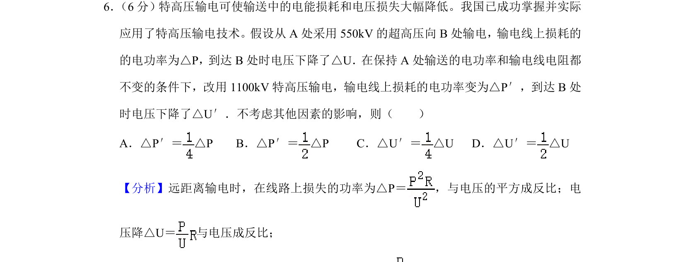
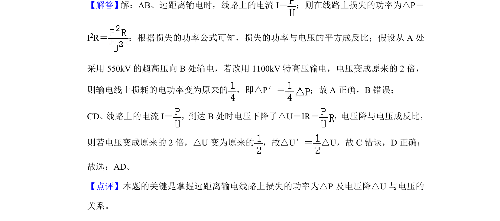

## 题面

## 摘要

特高压输电中，输电线上功率损耗和电压降与输电电压的关系判断。

## 关联考点

- [[414-远距离输电|远距离输电]]
- [[730-输电损耗|输电损耗]]
- [[670-电压降|电压降]]
- [[752-高压输电|高压输电]]

## 答案与解析

> 📄 原 PDF 第 5 页：`素材/真题/吉林/2008-2024·（吉林）物理高考真题/2020年高考物理试卷（新课标Ⅱ）（解析卷）.pdf`

<!-- 题干文本-start -->
## 题干文本
6． （6分）特高压输电可使输送中的电能损耗和电压损失大幅降低。我国已成功掌握并实际
应用了特高压输电技术。假设从A处采用550kV的超高压向B处输电，输电线上损耗的
的电功率为△P，到达B处时电压下降了△U．在保持A处输送的电功率和输电线电阻都
不变的条件下，改用1100kV特高压输电，输电线上损耗的电功率变为△P′，到达B处
时电压下降了△U′．不考虑其他因素的影响，则（　　）
A．△P′＝ △P B．△P′＝ △P C．△U′＝ △U D．△U′＝ △U
<!-- 题干文本-end -->

<!-- 解析文本-start -->
## 解析文本
【分析】远距离输电时，在线路上损失的功率为△P＝ ，与电压的平方成反比；电
压降△U＝ 与电压成反比；
【解答】解：AB、远距离输电时，线路上的电流I＝ ；则在线路上损失的功率为△P＝
I2R＝ ；根据损失的功率公式可知，损失的功率与电压的平方成反比；假设从A处
采用550kV的超高压向B处输电，若改用1100kV特高压输电，电压变成原来的2倍，
则输电线上损耗的电功率变为原来的 ，即△P′＝ ；故A正确，B错误；
CD、线路上的电流I＝ ，到达B处时电压下降了△U＝IR＝ ，电压降与电压成反比，
则若电压变成原来的2倍，△U变为原来的 ，故△U′＝ △U，故C错误，D正确；
故选：AD。
【点评】本题的关键是掌握远距离输电线路上损失的功率为△P及电压降△U与电压的
关系。
<!-- 解析文本-end -->
