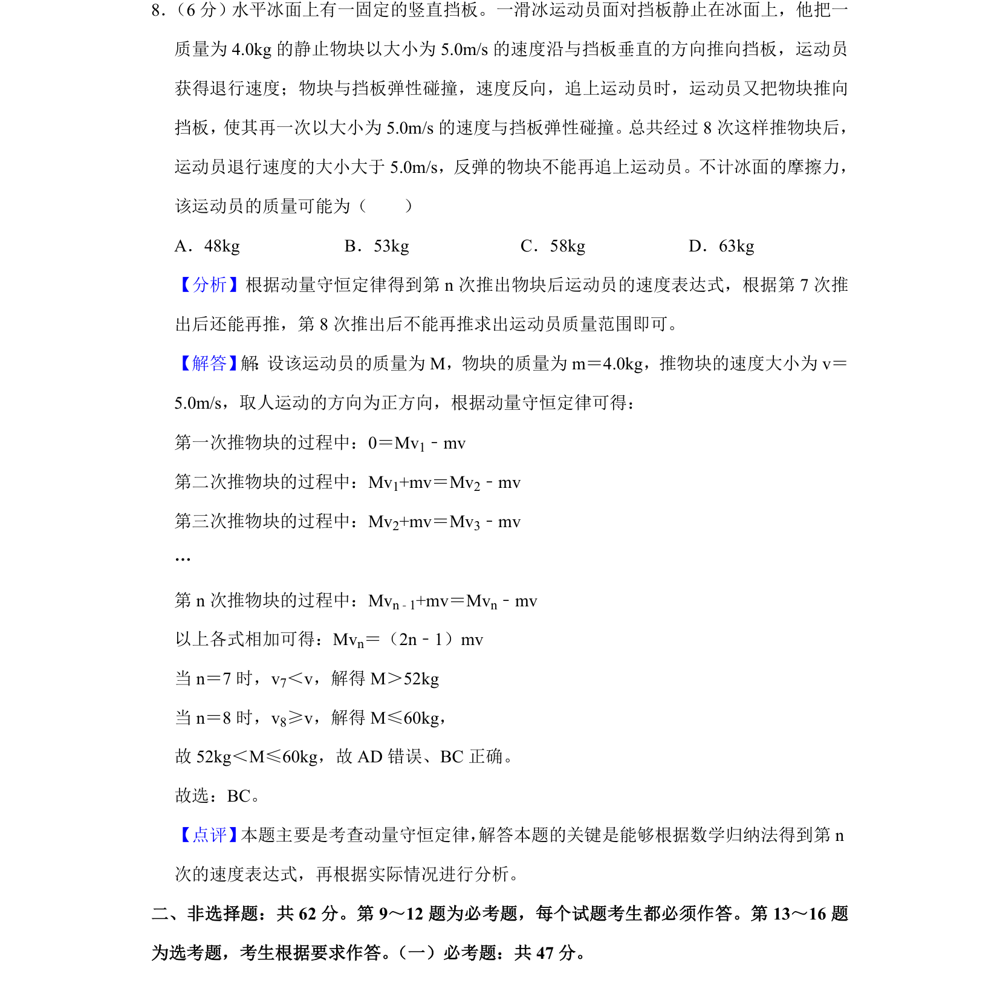

## 题面

## 摘要

一滑冰运动员反复推物块与挡板弹性碰撞，利用动量守恒求运动员质量范围。

## 关联考点

- [[347-动量守恒定律|动量守恒定律]]
- [[386-数学归纳法-初步|数学归纳法]]
- [[不等式求解]]

## 答案与解析

> 📄 原 PDF 第 7 页：`素材/真题/吉林/2008-2024·（吉林）物理高考真题/2020年高考物理试卷（新课标Ⅱ）（解析卷）.pdf`
