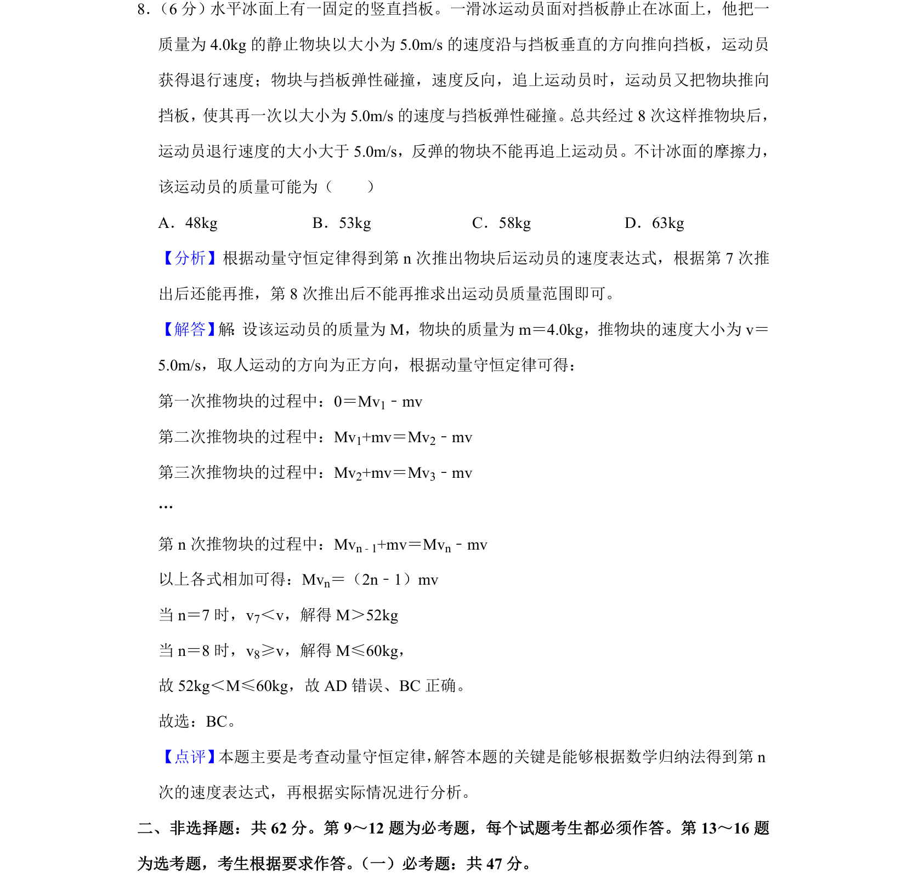
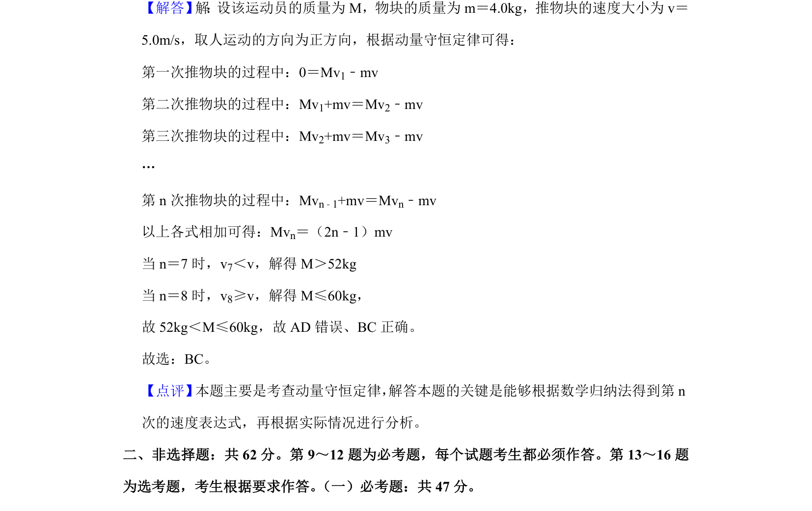

## 题面

## 摘要

多次推物块与挡板弹性碰撞，利用动量守恒求运动员质量范围。

## 关联考点

- [[347-动量守恒定律|动量守恒定律]]
- [[578-完全弹性碰撞|完全弹性碰撞]]
- [[608-归纳法|归纳法]]
- [[506-临界条件|临界条件]]

## 答案与解析

> 📄 原 PDF 第 7 页：`素材/真题/吉林/2008-2024·（吉林）物理高考真题/2020年高考物理试卷（新课标Ⅱ）（解析卷）.pdf`

<!-- 题干文本-start -->
## 题干文本
8． （6分）水平冰面上有一固定的竖直挡板。一滑冰运动员面对挡板静止在冰面上，他把一
质量为4.0kg的静止物块以大小为5.0m/s的速度沿与挡板垂直的方向推向挡板，运动员
获得退行速度；物块与挡板弹性碰撞，速度反向，追上运动员时，运动员又把物块推向
挡板，使其再一次以大小为5.0m/s的速度与挡板弹性碰撞。总共经过8次这样推物块后，
运动员退行速度的大小大于5.0m/s，反弹的物块不能再追上运动员。不计冰面的摩擦力，
该运动员的质量可能为（　　）
A．48kg B．53kg C．58kg D．63kg
<!-- 题干文本-end -->

<!-- 解析文本-start -->
## 解析文本
【分析】根据动量守恒定律得到第n次推出物块后运动员的速度表达式，根据第7次推
出后还能再推，第8次推出后不能再推求出运动员质量范围即可。
【解答】 解 ： 设该运动员的质量为M，物块的质量为m＝4.0kg，推物块的速度大小为v＝
5.0m/s，取人运动的方向为正方向，根据动量守恒定律可得：
第一次推物块的过程中：0＝Mv1﹣mv
第二次推物块的过程中：Mv1+mv＝Mv2﹣mv
第三次推物块的过程中：Mv2+mv＝Mv3﹣mv
…
第n次推物块的过程中：Mv n﹣1+mv＝Mvn﹣mv
以上各式相加可得：Mvn＝（2n﹣1）mv
当n＝7时，v 7＜v，解得M＞52kg
当n＝8时，v 8≥v，解得M≤60kg，
故52kg＜M≤60kg，故AD错误、BC正确。
故选：BC。
【点评】 本题主要是考查动量守恒定律， 解答本题的关键是能够根据数学归纳法得到第n
次的速度表达式，再根据实际情况进行分析。
二、非选择题：共62分。第9～12题为必考题，每个试题考生都必须作答。第13～16题
为选考题，考生根据要求作答。 （一）必考题：共47分。
<!-- 解析文本-end -->
