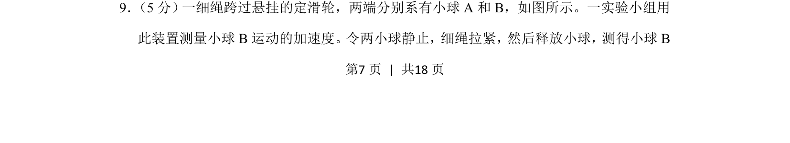
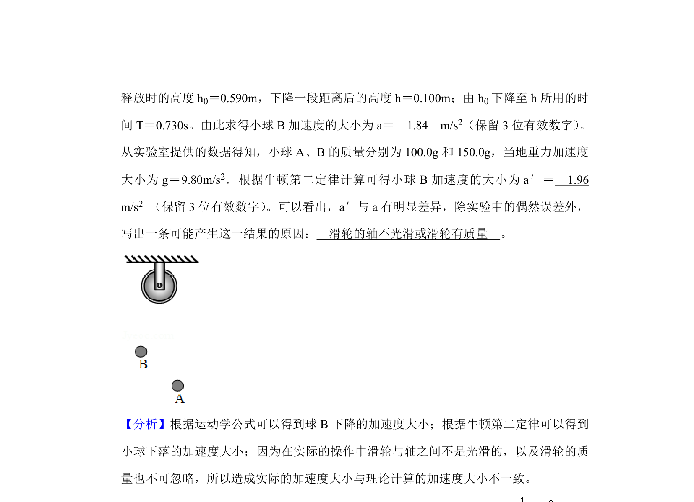
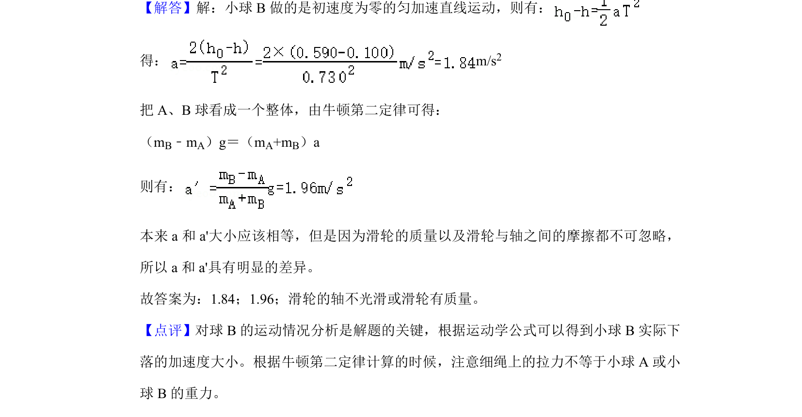

## 题面

## 摘要

测量小球B运动的加速度的实验题，涉及细绳悬挂释放小球模型

## 关联考点

- [[732-运动学|运动学]]
- [[584-实验测量|实验测量]]
- [[531-力学模型|力学模型]]

## 答案与解析

> 📄 原 PDF 第 7 页：`素材/真题/吉林/2008-2024·（吉林）物理高考真题/2020年高考物理试卷（新课标Ⅱ）（解析卷）.pdf`
