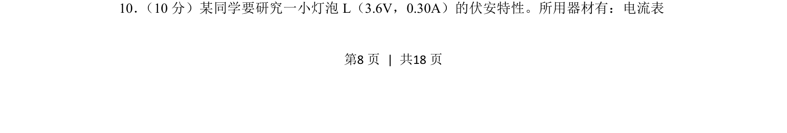
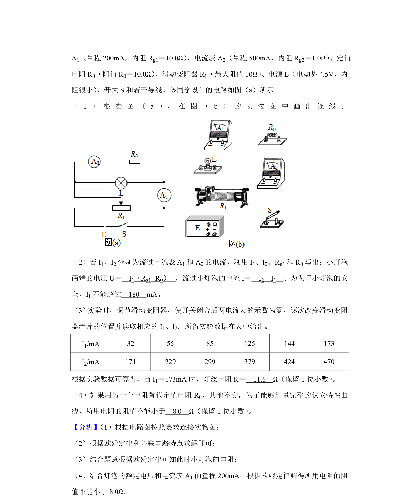
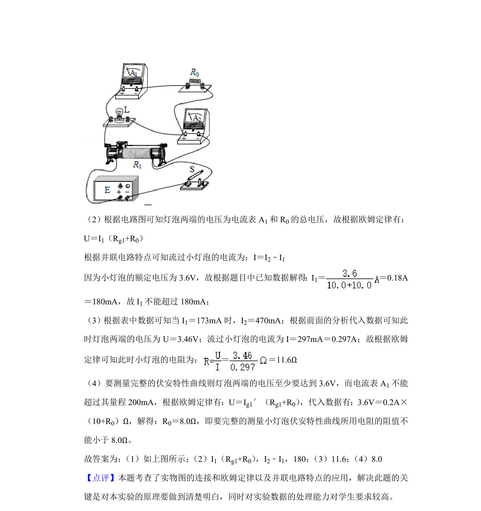

## 题面

## 摘要

研究小灯泡伏安特性曲线的实验电路设计与操作

## 关联考点

- [[512-伏安特性曲线|伏安特性曲线]]
- [[656-滑动变阻器分压接法|滑动变阻器分压接法]]
- [[693-电表选择与连接|电表选择与连接]]

## 答案与解析

> 📄 原 PDF 第 8 页：`素材/真题/吉林/2008-2024·（吉林）物理高考真题/2020年高考物理试卷（新课标Ⅱ）（解析卷）.pdf`
