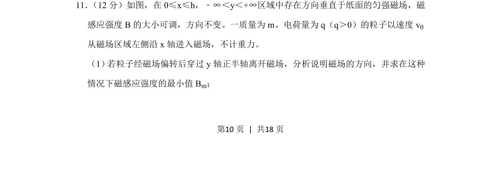
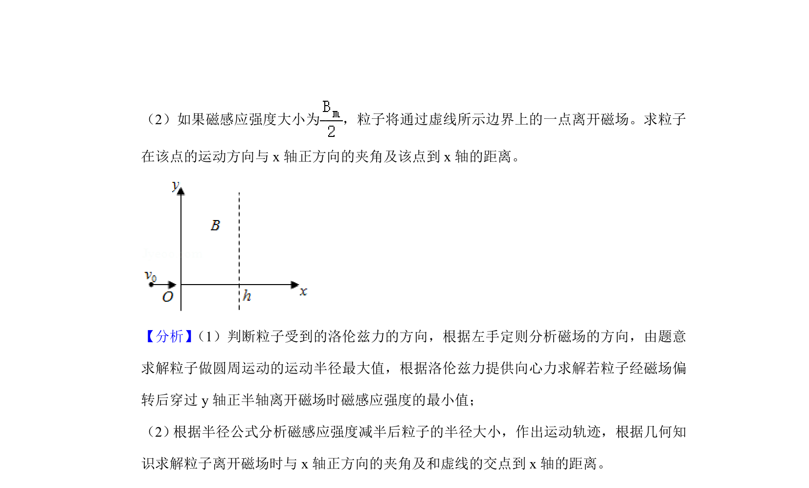
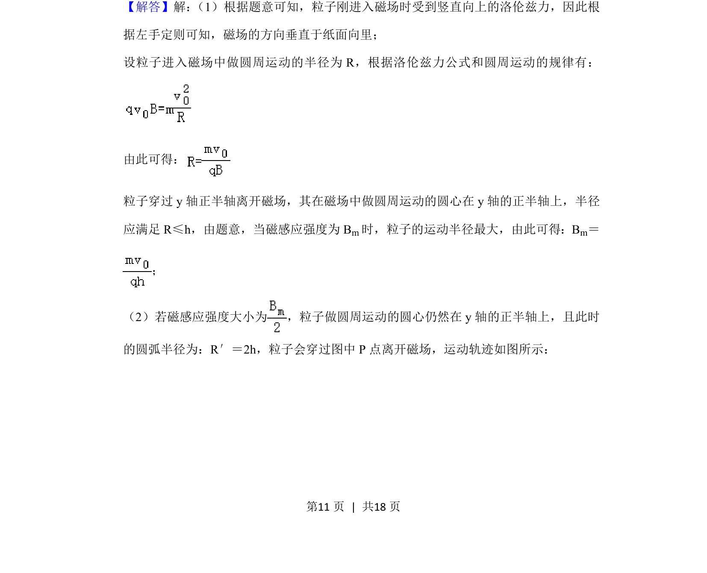
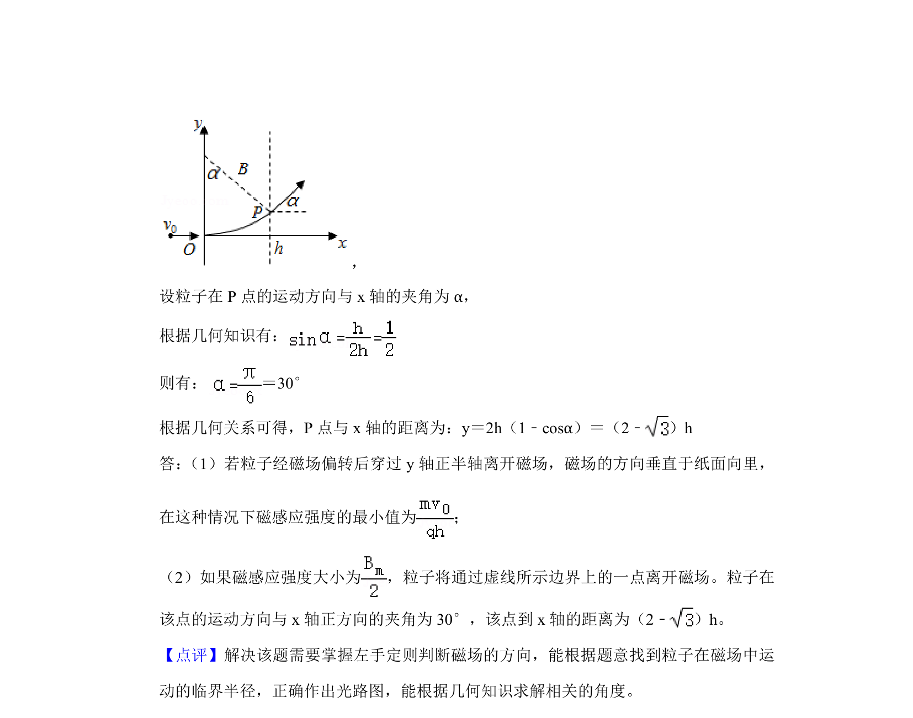

## 题面

## 摘要

带电粒子在匀强磁场中偏转，分析磁场方向并求磁感应强度最小值

## 关联考点

- [[304-洛伦兹力|洛伦兹力]]
- [[258-圆周运动|圆周运动]]
- [[506-临界条件|临界条件]]

## 答案与解析

> 📄 原 PDF 第 10 页：`素材/真题/吉林/2008-2024·（吉林）物理高考真题/2020年高考物理试卷（新课标Ⅱ）（解析卷）.pdf`
