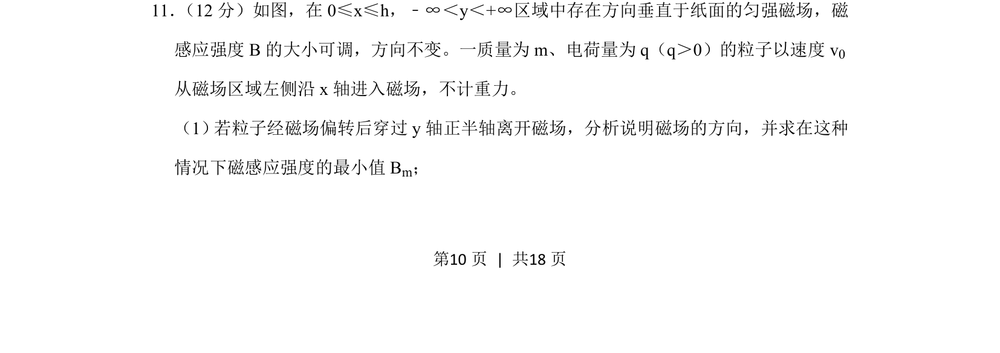
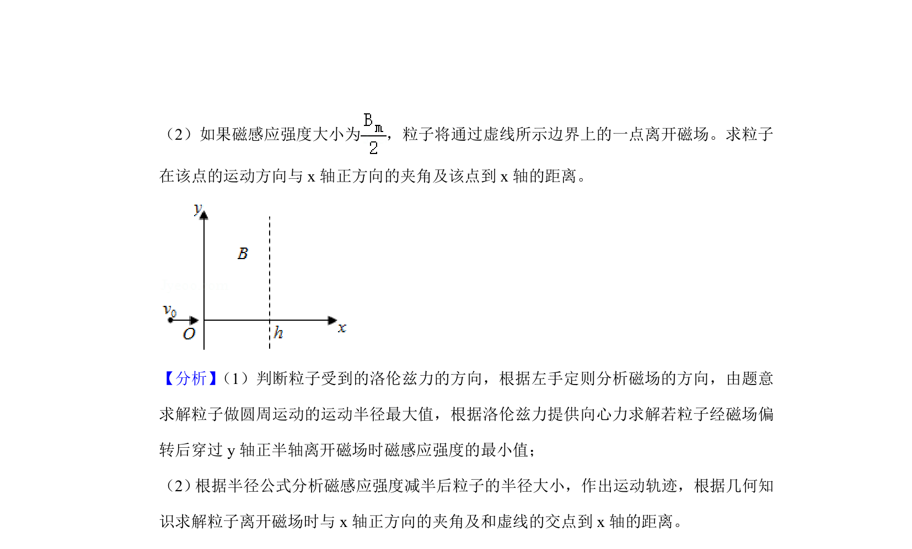
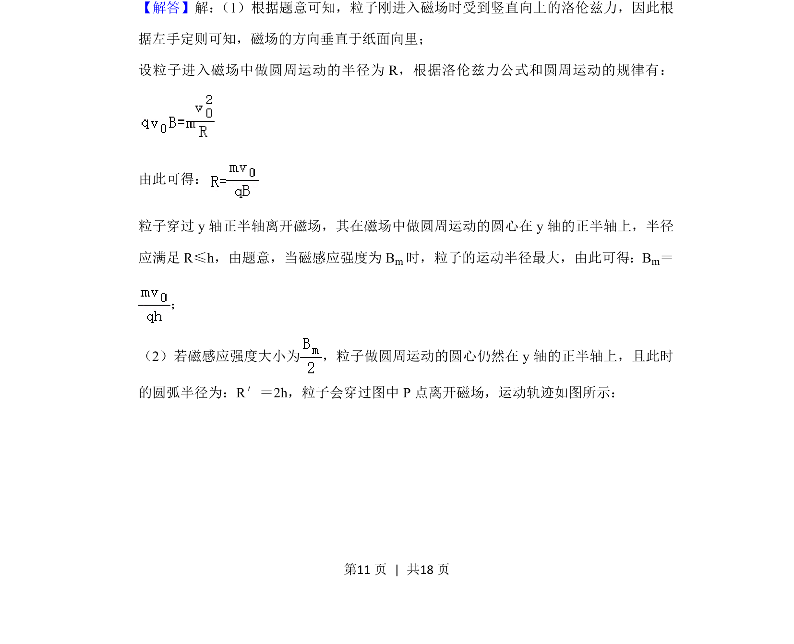
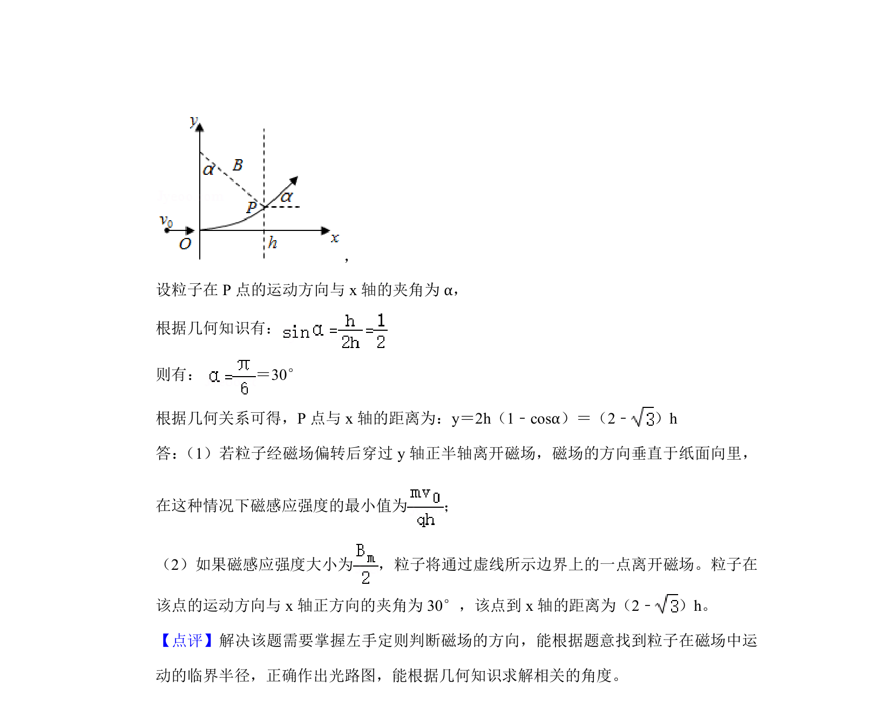

## 题面

## 摘要

带电粒子在匀强磁场中偏转，分析磁场方向并求磁感应强度最小值

## 关联考点

- [[304-洛伦兹力|洛伦兹力]]
- [[258-圆周运动|圆周运动]]
- [[506-临界条件|临界条件]]

## 答案与解析

> 📄 原 PDF 第 10 页：`素材/真题/吉林/2008-2024·（吉林）物理高考真题/2020年高考物理试卷（新课标Ⅱ）（解析卷）.pdf`

<!-- 题干文本-start -->
## 题干文本
11． （12分）如图，在0≤x≤h，﹣∞＜y＜+∞区域中存在方向垂直于纸面的匀强磁场，磁
感应强度B的大小可调，方向不变。一质量为m、电荷量为q（q＞0）的粒子以速度v 0
从磁场区域左侧沿x轴进入磁场，不计重力。
（1） 若粒子经磁场偏转后穿过y轴正半轴离开磁场，分析说明磁场的方向，并求在这种
情况下磁感应强度的最小值B m；
<!-- 题干文本-end -->

<!-- 解析文本-start -->
## 解析文本

<!-- 解析文本-end -->
