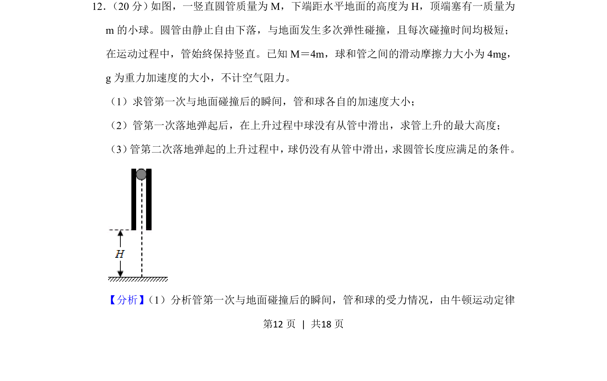
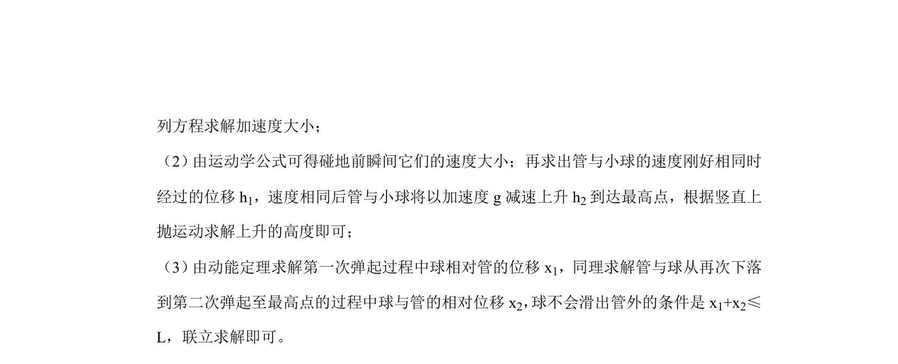
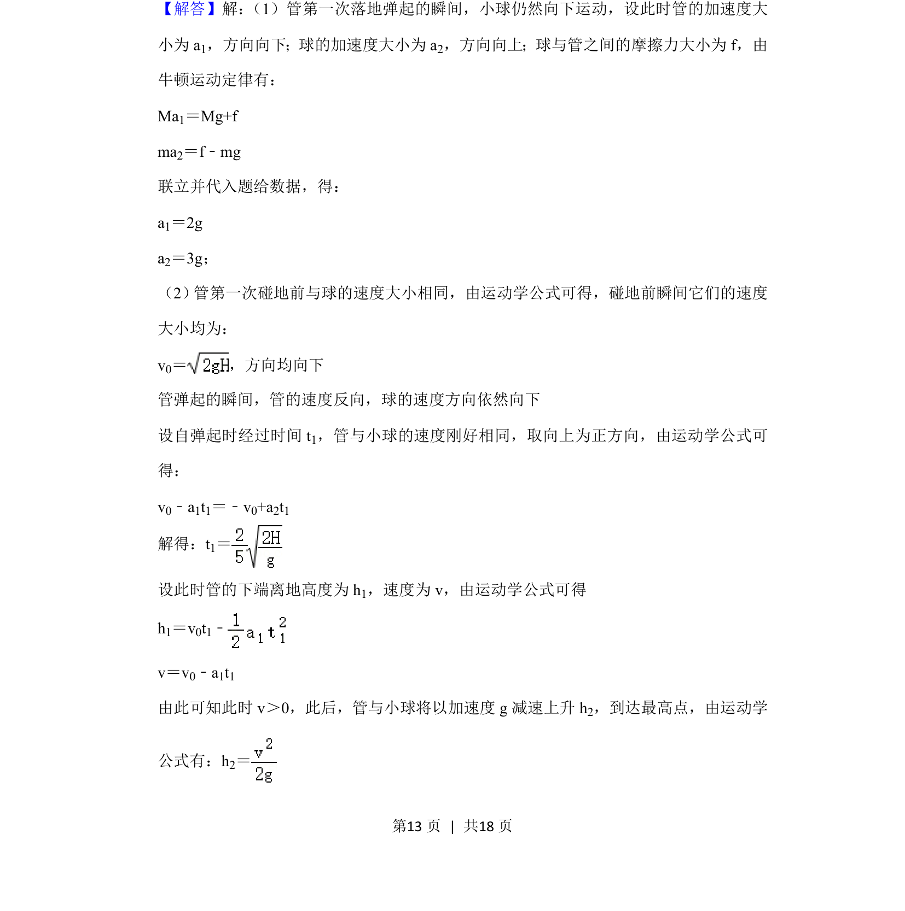
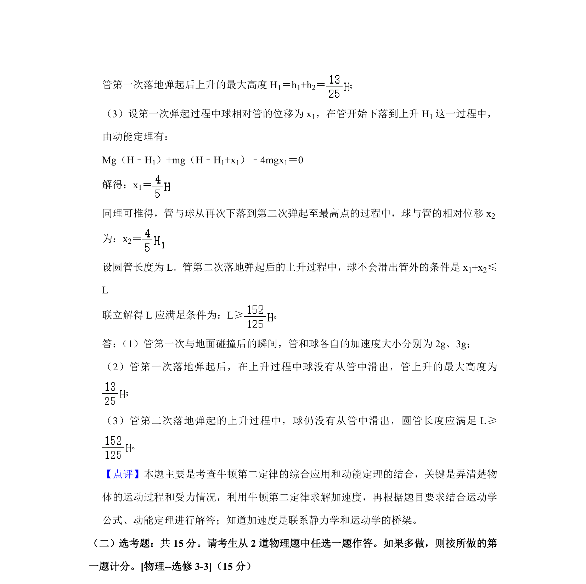

## 题面

## 摘要

考查竖直圆管与小球的多过程运动，涉及牛顿定律、摩擦力和弹性碰撞分析。

## 关联考点

- [[229-牛顿第二定律|牛顿第二定律]]
- [[097-滑动摩擦力|滑动摩擦力]]
- [[215-匀变速直线运动|匀变速直线运动]]
- [[359-弹性碰撞|弹性碰撞]]

## 答案与解析

> 📄 原 PDF 第 12 页：`素材/真题/吉林/2008-2024·（吉林）物理高考真题/2020年高考物理试卷（新课标Ⅱ）（解析卷）.pdf`
