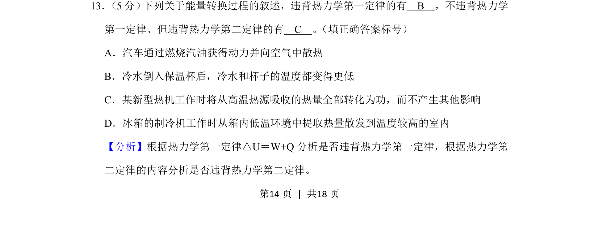
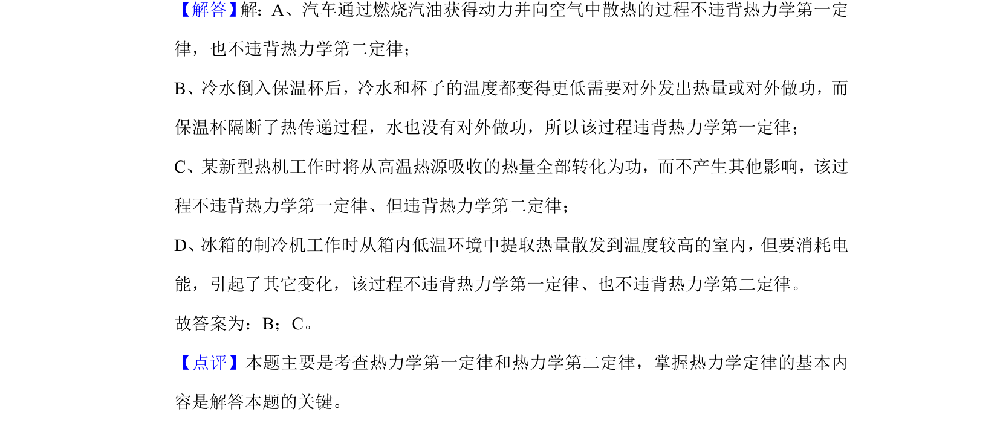

## 题面

## 摘要

考查根据热力学第一定律和第二定律判断能量转换过程是否违背

## 关联考点

- [[440-热力学第一定律|热力学第一定律]]
- [[441-热力学第二定律|热力学第二定律]]

## 答案与解析

> 📄 原 PDF 第 14 页：`素材/真题/吉林/2008-2024·（吉林）物理高考真题/2020年高考物理试卷（新课标Ⅱ）（解析卷）.pdf`

<!-- 题干文本-start -->
## 题干文本
13． （5分） 下列关于能量转换过程的叙述，违背热力学第一定律的有　B　，不违背热力学
第一定律、但违背热力学第二定律的有　C　。 （填正确答案标号）
A．汽车通过燃烧汽油获得动力并向空气中散热
B．冷水倒入保温杯后，冷水和杯子的温度都变得更低
C．某新型热机工作时将从高温热源吸收的热量全部转化为功，而不产生其他影响
D．冰箱的制冷机工作时从箱内低温环境中提取热量散发到温度较高的室内
<!-- 题干文本-end -->

<!-- 解析文本-start -->
## 解析文本
【分析】根据热力学第一定律△U＝W+Q分析是否违背热力学第一定律，根据热力学第
二定律的内容分析是否违背热力学第二定律。
<!-- 解析文本-end -->
