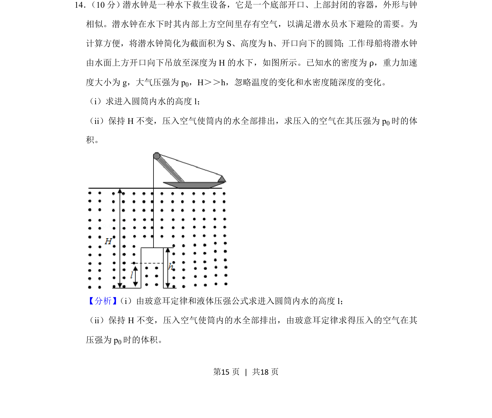
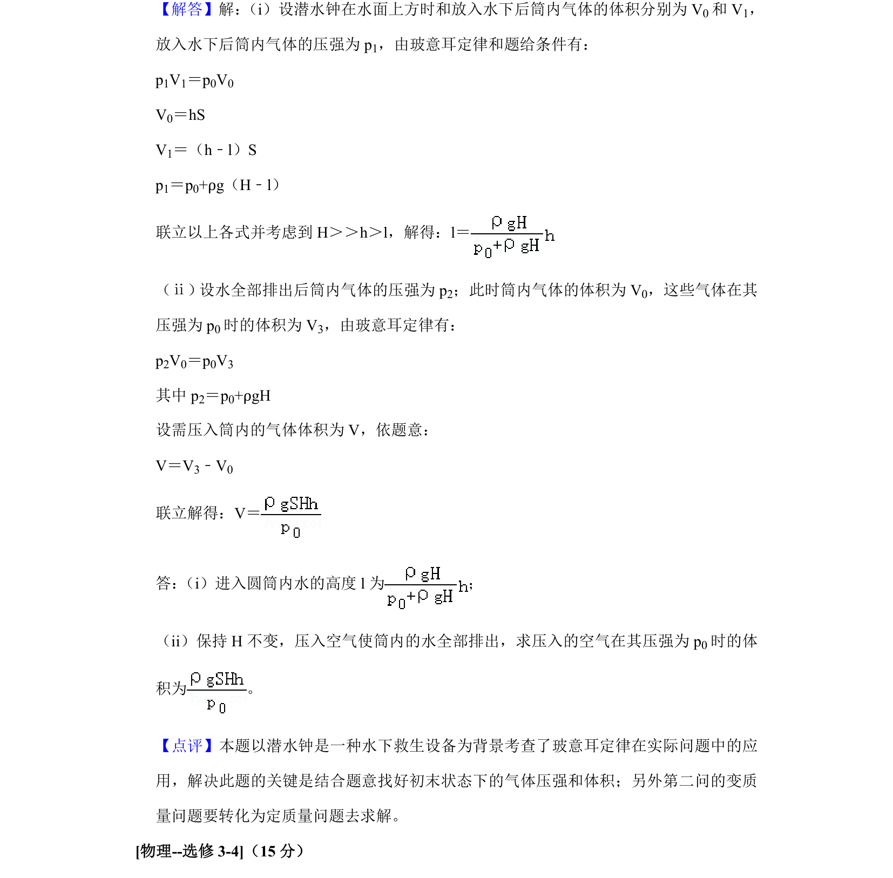

## 题面

## 摘要

利用玻意耳定律和液体压强公式，求解水下圆筒内进水高度及排出水所需压入空气的体积。

## 关联考点

- [[444-玻意耳定律|玻意耳定律]]
- [[652-液体压强公式|液体压强公式]]
- [[649-代数运算|代数运算]]

## 答案与解析

> 📄 原 PDF 第 15 页：`素材/真题/吉林/2008-2024·（吉林）物理高考真题/2020年高考物理试卷（新课标Ⅱ）（解析卷）.pdf`
