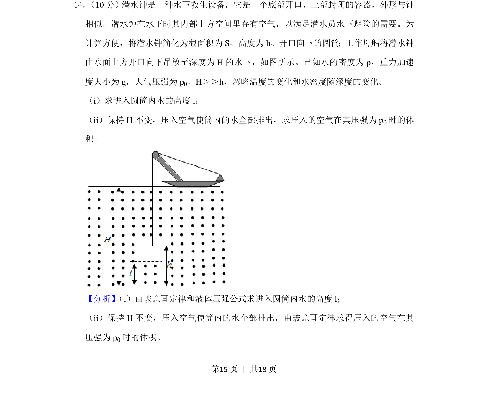
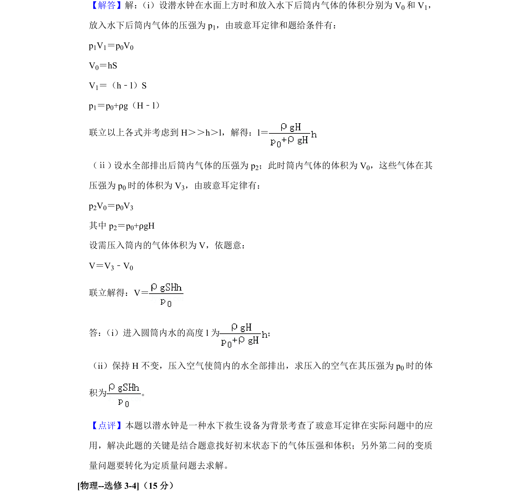

## 题面

## 摘要

利用玻意耳定律和液体压强公式，求解水下圆筒内进水高度及排出水所需压入空气的体积。

## 关联考点

- [[444-玻意耳定律|玻意耳定律]]
- [[652-液体压强公式|液体压强公式]]
- [[649-代数运算|代数运算]]

## 答案与解析

> 📄 原 PDF 第 15 页：`素材/真题/吉林/2008-2024·（吉林）物理高考真题/2020年高考物理试卷（新课标Ⅱ）（解析卷）.pdf`

<!-- 题干文本-start -->
## 题干文本
14． （10分）潜水钟是一种水下救生设备，它是一个底部开口、上部封闭的容器，外形与钟
相似。潜水钟在水下时其内部上方空间里存有空气，以满足潜水员水下避险的需要。为
计算方便，将潜水钟简化为截面积为S、高度为h、开口向下的圆筒；工作母船将潜水钟
由水面上方开口向下吊放至深度为H的水下，如图所示。已知水的密度为ρ，重力加速
度大小为g，大气压强为p 0，H＞＞h，忽略温度的变化和水密度随深度的变化。
（i）求进入圆筒内水的高度l；
（ii）保持H不变，压入空气使筒内的水全部排出，求压入的空气在其压强为p 0时的体
积。
<!-- 题干文本-end -->

<!-- 解析文本-start -->
## 解析文本
【分析】 （i）由玻意耳定律和液体压强公式求进入圆筒内水的高度l；
（ii）保持H不变，压入空气使筒内的水全部排出，由玻意耳定律求得压入的空气在其
压强为p 0时的体积。
<!-- 解析文本-end -->
