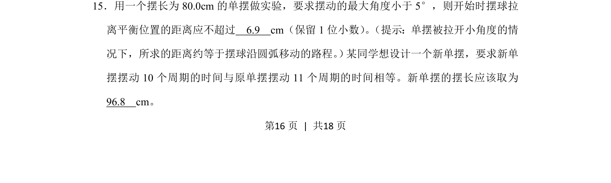
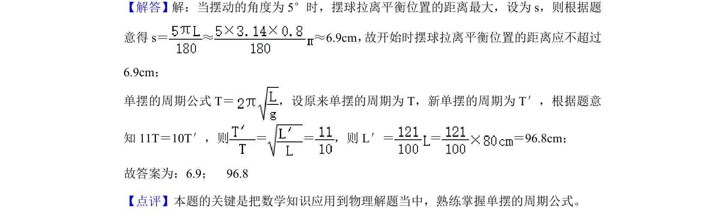

## 题面

## 摘要

单摆小角度摆动时弧长与弦长近似相等，并利用周期公式计算摆长变化。

## 关联考点

- [[351-单摆周期公式|单摆周期公式]]
- [[592-小角度近似|小角度近似]]
- [[373-简谐运动|简谐运动]]

## 答案与解析

> 📄 原 PDF 第 16 页：`素材/真题/吉林/2008-2024·（吉林）物理高考真题/2020年高考物理试卷（新课标Ⅱ）（解析卷）.pdf`

<!-- 题干文本-start -->
## 题干文本
15．用一个摆长为80.0cm的单摆做实验，要求摆动的最大角度小于5°，则开始时摆球拉
离平衡位置的距离应不超过　6.9　cm（保留1位小数） 。 （提示：单摆被拉开小角度的情
况下，所求的距离约等于摆球沿圆弧移动的路程。 ） 某同学想设计一个新单摆，要求新单
摆摆动10个周期的时间与原单摆摆动11个周期的时间相等。新单摆的摆长应该取为　
96.8　cm。
<!-- 题干文本-end -->

<!-- 解析文本-start -->
## 解析文本

<!-- 解析文本-end -->
