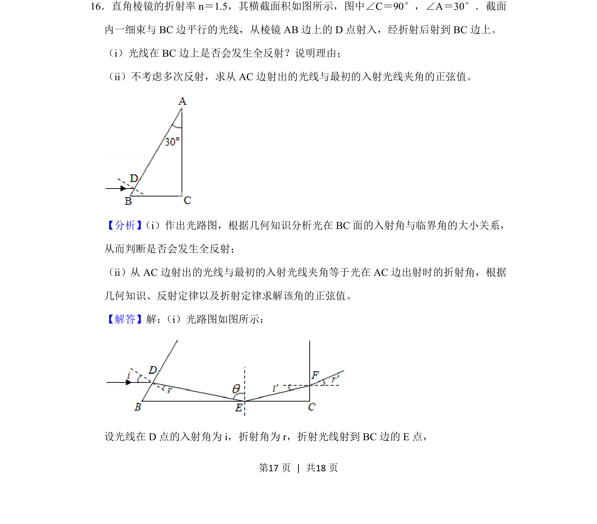
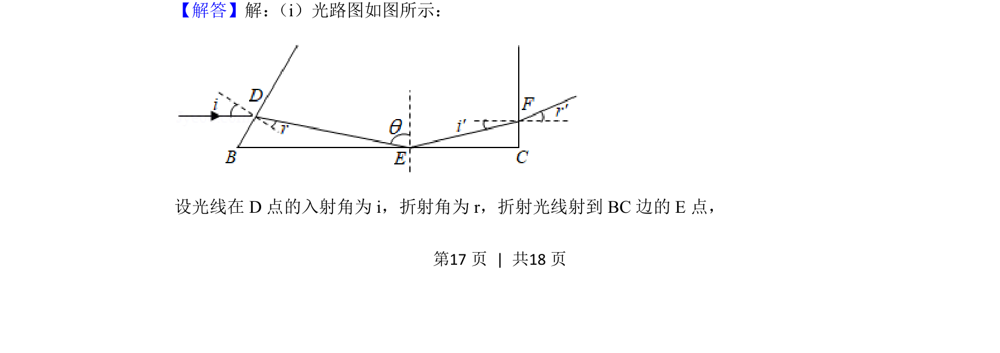
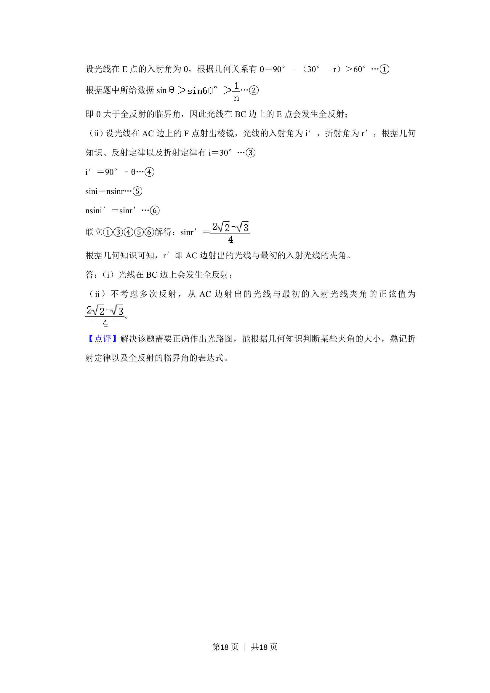

## 题面

## 摘要

光线折射与全反射判断，结合几何关系求解出射光线与入射光线夹角的正弦值

## 关联考点

- [[026-折射定律|折射定律]]
- [[522-全反射临界角|全反射临界角]]
- [[525-几何角度关系|几何角度关系]]
- [[126-定理|正弦定理]]

## 答案与解析

> 📄 原 PDF 第 17 页：`素材/真题/吉林/2008-2024·（吉林）物理高考真题/2020年高考物理试卷（新课标Ⅱ）（解析卷）.pdf`
