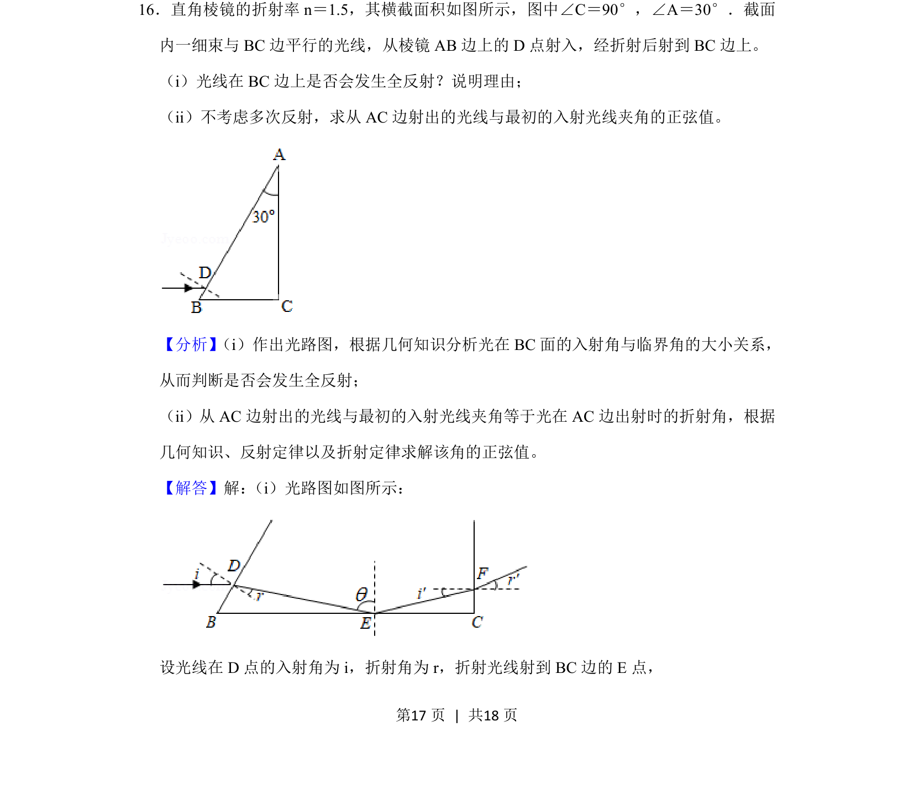
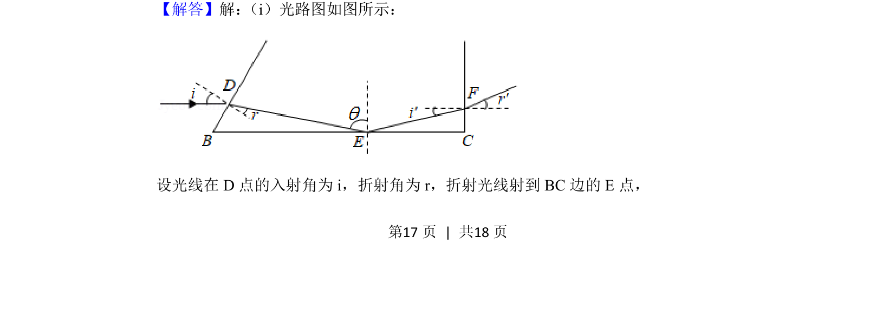
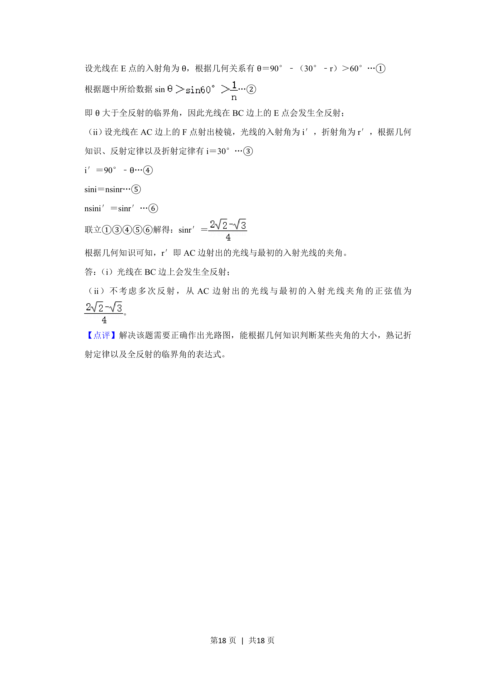

## 题面

## 摘要

光线折射与全反射判断，结合几何关系求解出射光线与入射光线夹角的正弦值

## 关联考点

- [[026-折射定律|折射定律]]
- [[522-全反射临界角|全反射临界角]]
- [[525-几何角度关系|几何角度关系]]
- [[126-定理|正弦定理]]

## 答案与解析

> 📄 原 PDF 第 17 页：`素材/真题/吉林/2008-2024·（吉林）物理高考真题/2020年高考物理试卷（新课标Ⅱ）（解析卷）.pdf`

<!-- 题干文本-start -->
## 题干文本
16．直角棱镜的折射率n＝1.5，其横截面积如图所示，图中∠C＝90°，∠A＝30°．截面
内一细束与BC边平行的光线，从棱镜AB边上的D点射入，经折射后射到BC边上。
（i）光线在BC边上是否会发生全反射？说明理由；
（ii）不考虑多次反射，求从AC边射出的光线与最初的入射光线夹角的正弦值。
<!-- 题干文本-end -->

<!-- 解析文本-start -->
## 解析文本
【分析】 （i）作出光路图，根据几何知识分析光在BC面的入射角与临界角的大小关系，
从而判断是否会发生全反射；
（ii）从AC边射出的光线与最初的入射光线夹角等于光在AC边出射时的折射角，根据
几何知识、反射定律以及折射定律求解该角的正弦值。
【解答】解： （i）光路图如图所示：
设光线在D点的入射角为i，折射角为r，折射光线射到BC边的E点，
<!-- 解析文本-end -->
