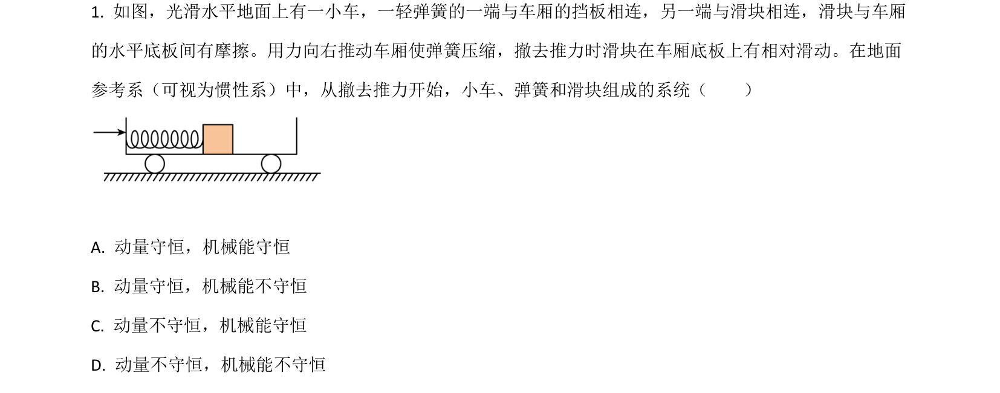
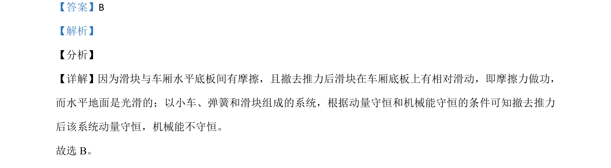

## 题面

## 摘要

分析滑块与车厢有摩擦时系统动量守恒和机械能守恒的条件。

## 关联考点

- [[539-动量守恒|动量守恒]]
- [[085-机械能守恒-初中|机械能守恒]]
- [[766-摩擦力做功|摩擦力做功]]

## 答案与解析

> 📄 原 PDF 第 1 页：`素材/真题/吉林/2008-2024·（吉林）物理高考真题/2021年高考物理试卷（全国乙卷）（解析卷）.pdf`
