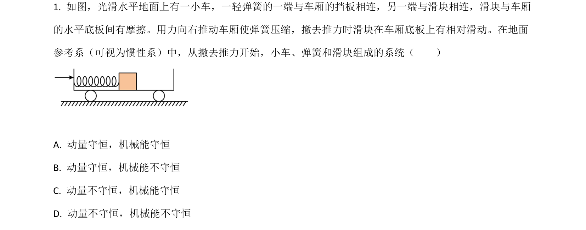
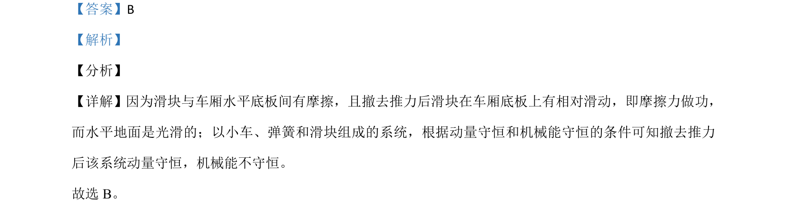

## 题面

## 摘要

分析滑块与车厢有摩擦时系统动量守恒和机械能守恒的条件。

## 关联考点

- [[539-动量守恒|动量守恒]]
- [[085-机械能守恒-初中|机械能守恒]]
- [[765-摩擦力做功|摩擦力做功]]

## 答案与解析

> 📄 原 PDF 第 1 页：`素材/真题/吉林/2008-2024·（吉林）物理高考真题/2021年高考物理试卷（全国乙卷）（解析卷）.pdf`

<!-- 题干文本-start -->
## 题干文本
1. 如图，光滑水平地面上有一小车，一轻弹簧的一端与车厢的挡板相连，另一端与滑块相连，滑块与车厢
的水平底板间有摩擦。用力向右推动车厢使弹簧压缩，撤去推力时滑块在车厢底板上有相对滑动。在地面
参考系（可视为惯性系）中，从撤去推力开始，小车、弹簧和滑块组成的系统（　　）
A. 动量守恒，机械能守恒
B. 动量守恒，机械能不守恒
C. 动量不守恒，机械能守恒
D. 动量不守恒，机械能不守恒
<!-- 题干文本-end -->

<!-- 解析文本-start -->
## 解析文本
【答案】B
【解析】
【分析】
【详解】因为滑块与车厢水平底板间有摩擦，且撤去推力后滑块在车厢底板上有相对滑动，即摩擦力做功，
而水平地面是光滑的；以小车、弹簧和滑块组成的系统，根据动量守恒和机械能守恒的条件可知撤去推力
后该系统动量守恒，机械能不守恒。
故选 B。
<!-- 解析文本-end -->
