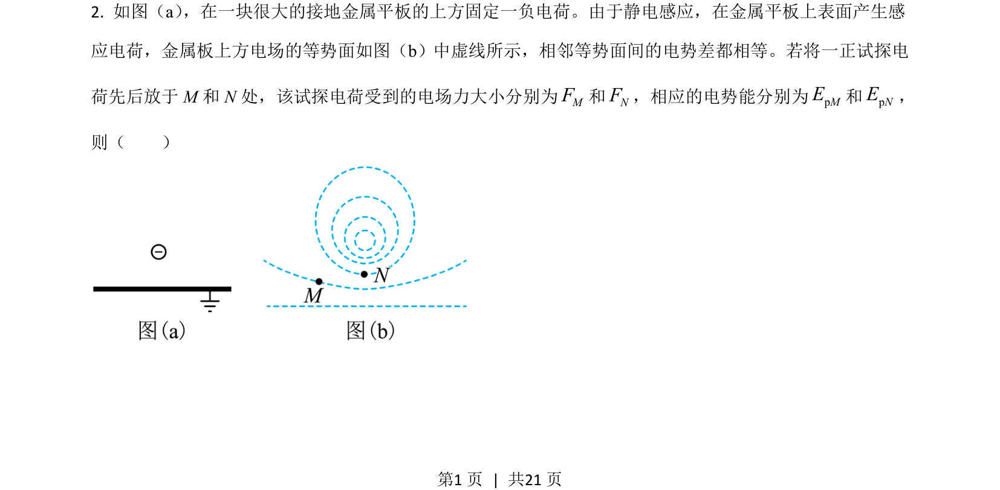
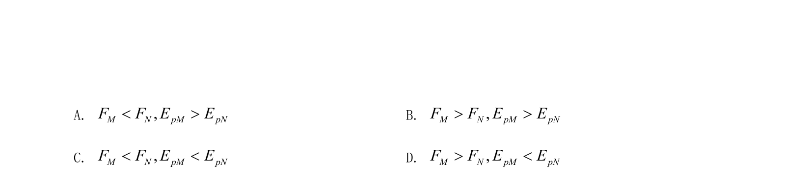
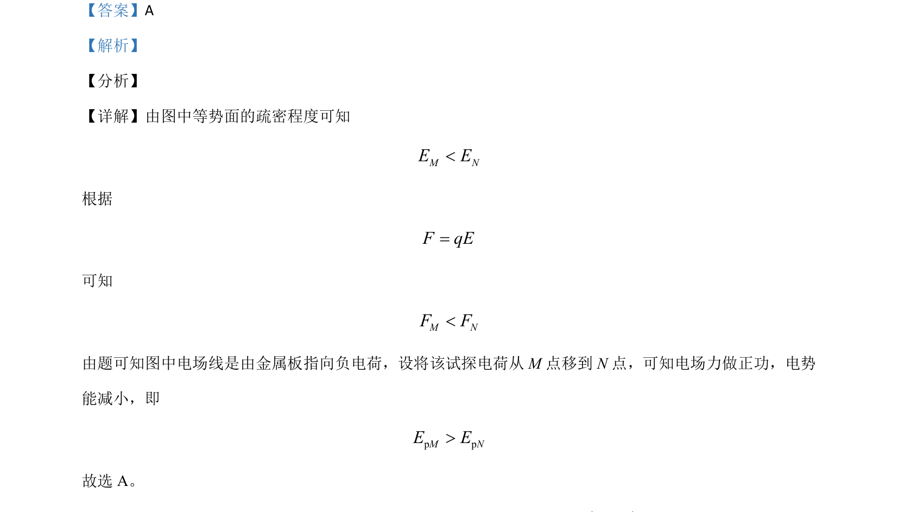

## 题面

## 摘要

考查电场中电场力做功与电势能变化的关系

## 关联考点

- [[278-电场线|电场线]]
- [[282-等势面|等势面]]
- [[673-电场力做功|电场力做功]]
- [[276-电势能|电势能]]

## 答案与解析

> 📄 原 PDF 第 1 页：`素材/真题/吉林/2008-2024·（吉林）物理高考真题/2021年高考物理试卷（全国乙卷）（解析卷）.pdf`
