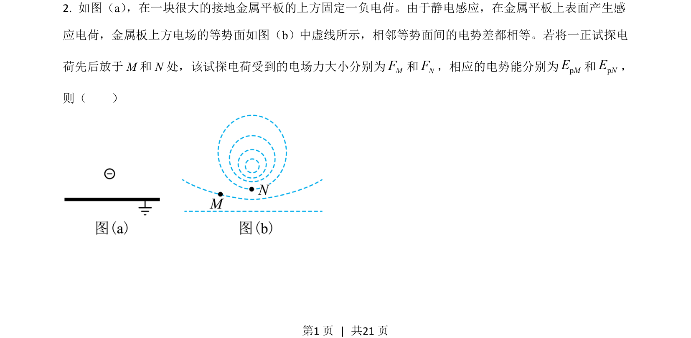
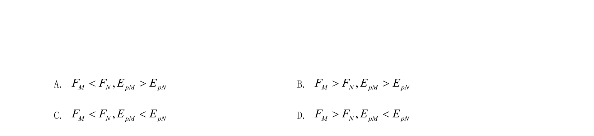
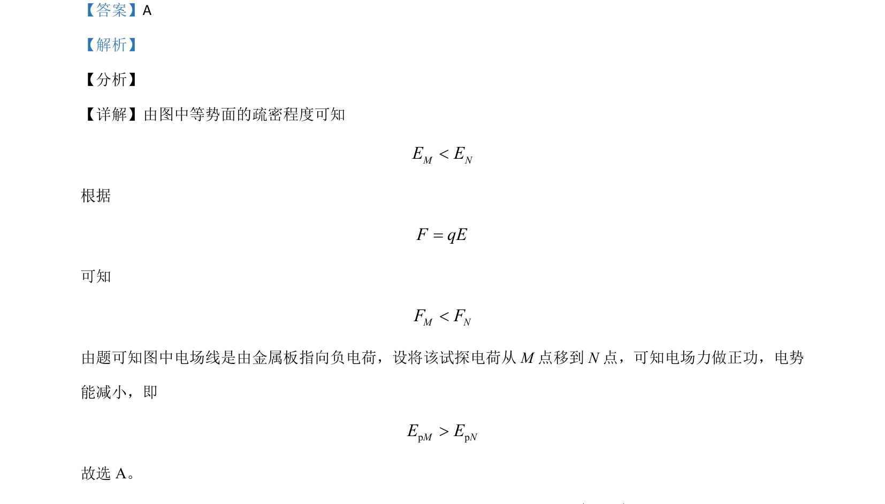

## 题面

## 摘要

考查电场中电场力做功与电势能变化的关系

## 关联考点

- [[278-电场线|电场线]]
- [[282-等势面|等势面]]
- [[673-电场力做功|电场力做功]]
- [[276-电势能|电势能]]

## 答案与解析

> 📄 原 PDF 第 1 页：`素材/真题/吉林/2008-2024·（吉林）物理高考真题/2021年高考物理试卷（全国乙卷）（解析卷）.pdf`

<!-- 题干文本-start -->
## 题干文本
2. 如图（a） ，在一块很大的接地金属平板的上方固定一负电荷。由于静电感应，在金属平板上表面产生感
应电荷，金属板上方电场的等势面如图（b）中虚线所示，相邻等势面间的电势差都相等。若将一正试探电
荷先后放于 M 和 N处，该试探电荷受到的电场力大小分别为MF和NF，相应的电势能分别为pME和pNE，
则（　　）
<!-- 题干文本-end -->

<!-- 解析文本-start -->
## 解析文本

<!-- 解析文本-end -->
