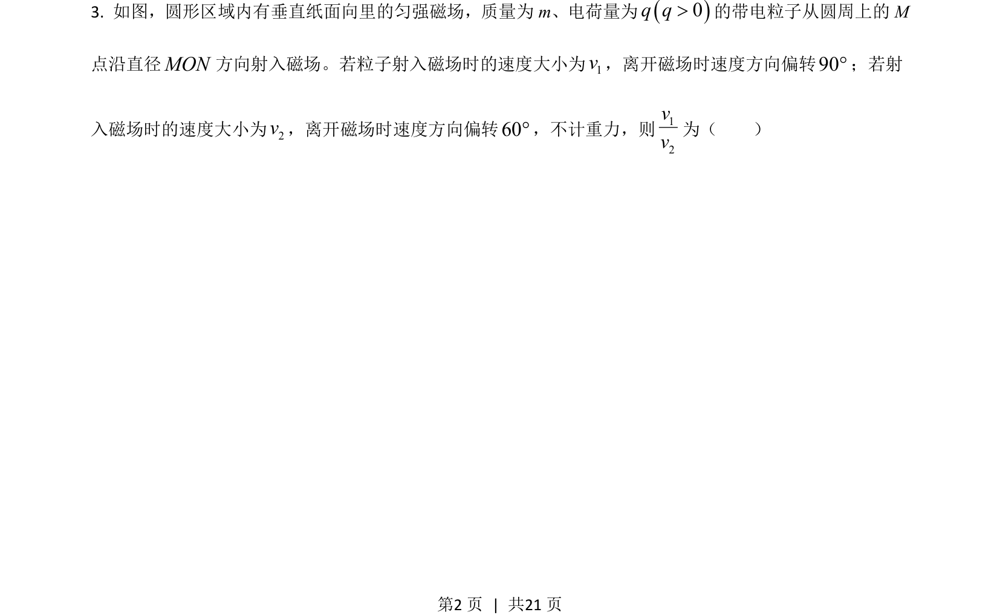
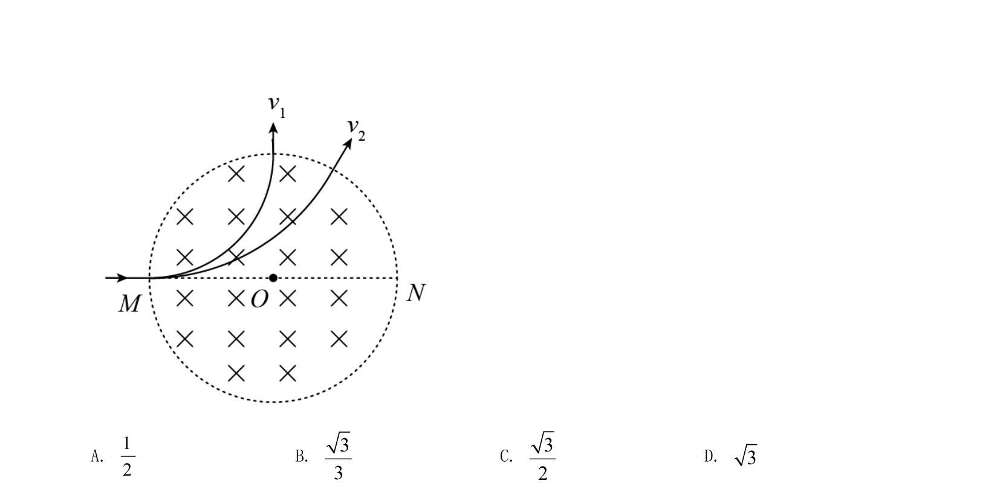
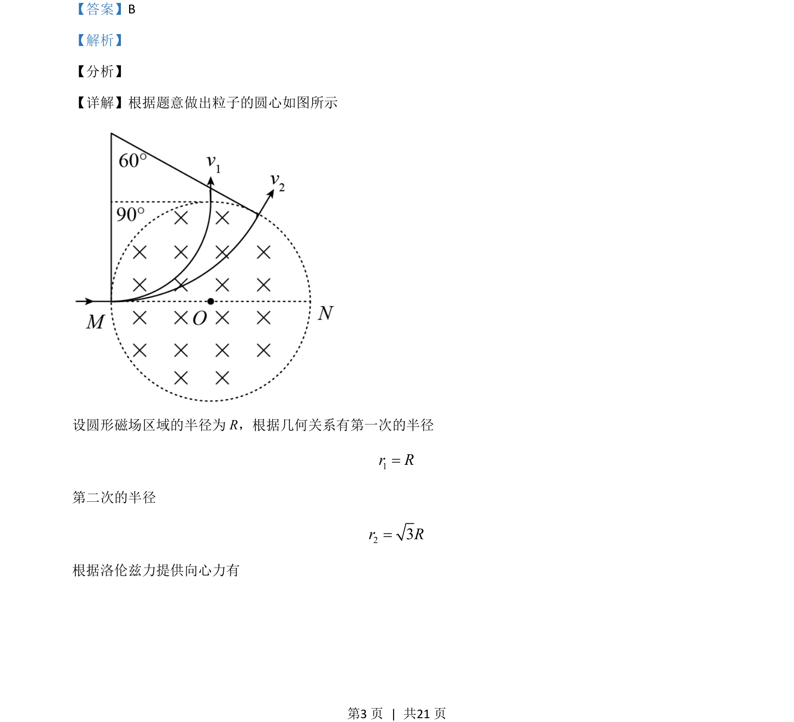
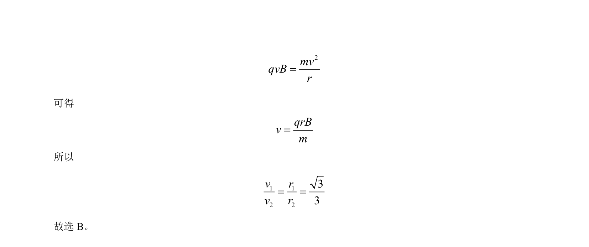

## 题面

## 摘要

带电粒子在圆形磁场区域运动，结合几何关系求速度比

## 关联考点

- [[649-洛伦兹力提供向心力|洛伦兹力提供向心力]]
- [[598-带电粒子在磁场中的圆周运动|带电粒子在磁场中的圆周运动]]
- [[456-几何关系|几何关系]]

## 答案与解析

> 📄 原 PDF 第 2 页：`素材/真题/吉林/2008-2024·（吉林）物理高考真题/2021年高考物理试卷（全国乙卷）（解析卷）.pdf`
