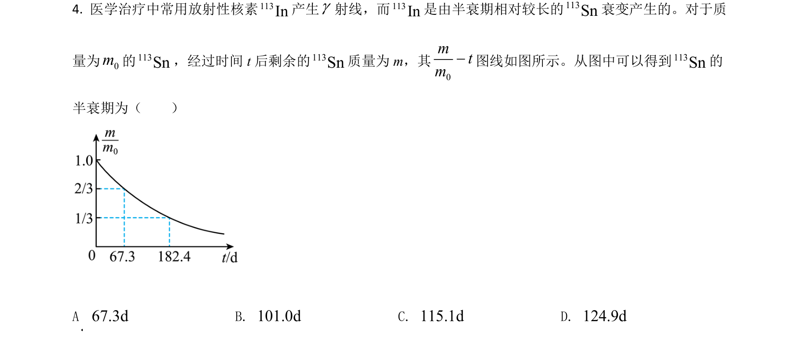
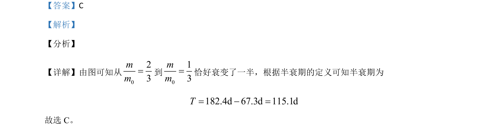

## 题面

## 摘要

该题通过图像信息考查半衰期的概念及简单计算。

## 关联考点

- [[424-半衰期|半衰期]]
- [[901-数据处理|数据处理]]

## 答案与解析

> 📄 原 PDF 第 4 页：`素材/真题/吉林/2008-2024·（吉林）物理高考真题/2021年高考物理试卷（全国乙卷）（解析卷）.pdf`

<!-- 题干文本-start -->
## 题干文本
4. 医学治疗中常用放射性核素113In产生g射线，而113In是由半衰期相对较长的113Sn衰变产生的。对于质
量为0m的113Sn，经过时间 t后剩余的113Sn质量为 m，其
0mtm-图线如图所示。从图中可以得到113Sn的
半衰期为（　　）
A  67.3dB. 101.0dC. 115.1dD. 124.9d
<!-- 题干文本-end -->

<!-- 解析文本-start -->
## 解析文本
【答案】C
【解析】
【分析】
【详解】由图可知从
023mm=到
013mm=恰好衰变了一半，根据半衰期的定义可知半衰期为
182.4d 67.3d 115.1dT= - =
故选 C。
<!-- 解析文本-end -->
