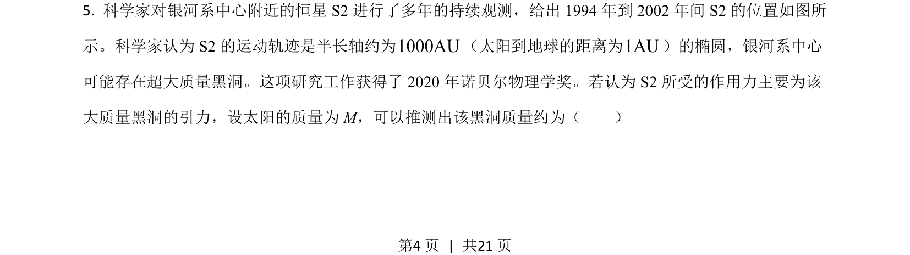
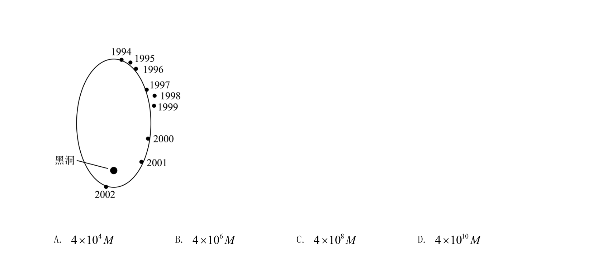
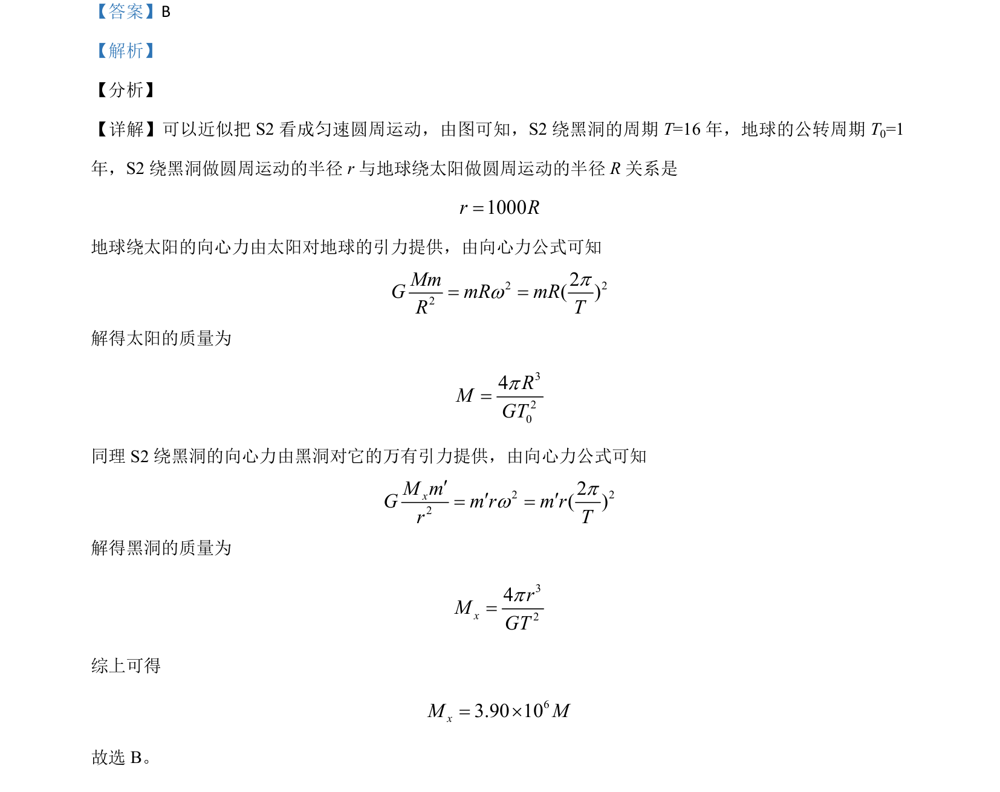

## 题面

## 摘要

通过万有引力提供向心力计算中心天体质量，比较地球与S2的运动参数

## 关联考点

- [[246-万有引力定律|万有引力定律]]
- [[561-向心力公式|向心力公式]]
- [[258-圆周运动|圆周运动]]
- [[503-中心天体质量|中心天体质量]]

## 答案与解析

> 📄 原 PDF 第 4 页：`素材/真题/吉林/2008-2024·（吉林）物理高考真题/2021年高考物理试卷（全国乙卷）（解析卷）.pdf`
