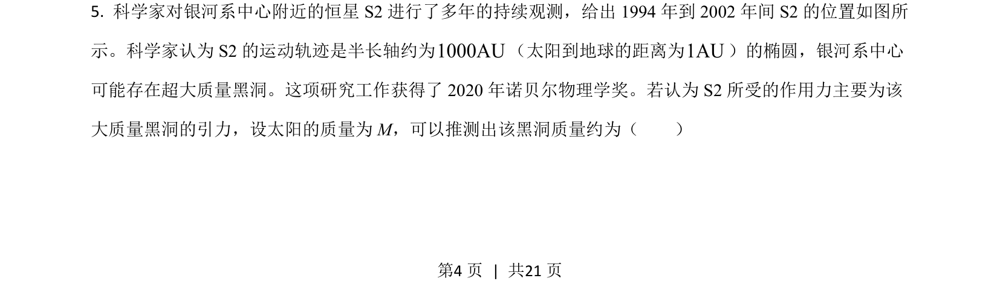
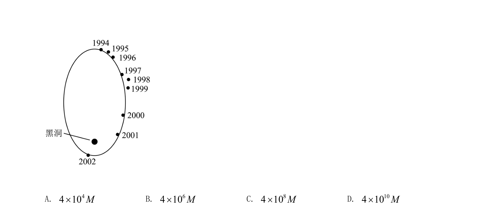
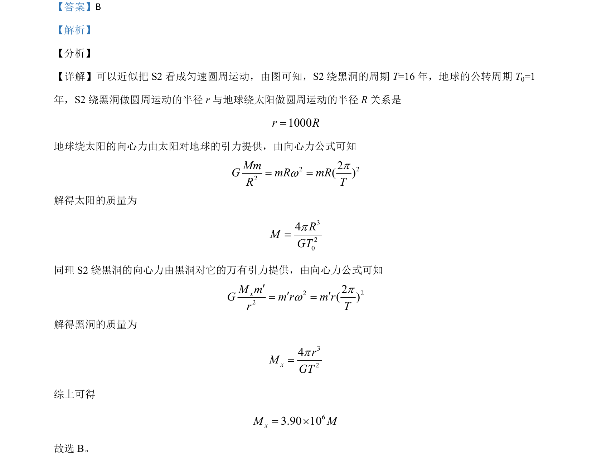

## 题面

## 摘要

通过万有引力提供向心力计算中心天体质量，比较地球与S2的运动参数

## 关联考点

- [[246-万有引力定律|万有引力定律]]
- [[561-向心力公式|向心力公式]]
- [[258-圆周运动|圆周运动]]
- [[503-中心天体质量|中心天体质量]]

## 答案与解析

> 📄 原 PDF 第 4 页：`素材/真题/吉林/2008-2024·（吉林）物理高考真题/2021年高考物理试卷（全国乙卷）（解析卷）.pdf`

<!-- 题干文本-start -->
## 题干文本
5. 科学家对银河系中心附近的恒星 S2 进行了多年的持续观测，给出 1994 年到 2002 年间 S2 的位置如图所
示。科学家认为 S2 的运动轨迹是半长轴约为1000AU（太阳到地球的距离为1AU）的椭圆，银河系中心
可能存在超大质量黑洞。这项研究工作获得了 2020 年诺贝尔物理学奖。若认为 S2 所受的作用力主要为该
大质量黑洞的引力，设太阳的质量为 M，可以推测出该黑洞质量约为（　　）
.
<!-- 题干文本-end -->

<!-- 解析文本-start -->
## 解析文本

<!-- 解析文本-end -->
