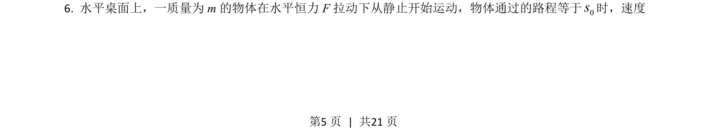
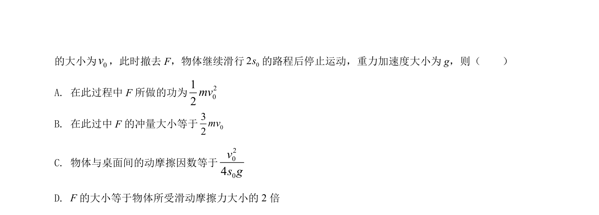
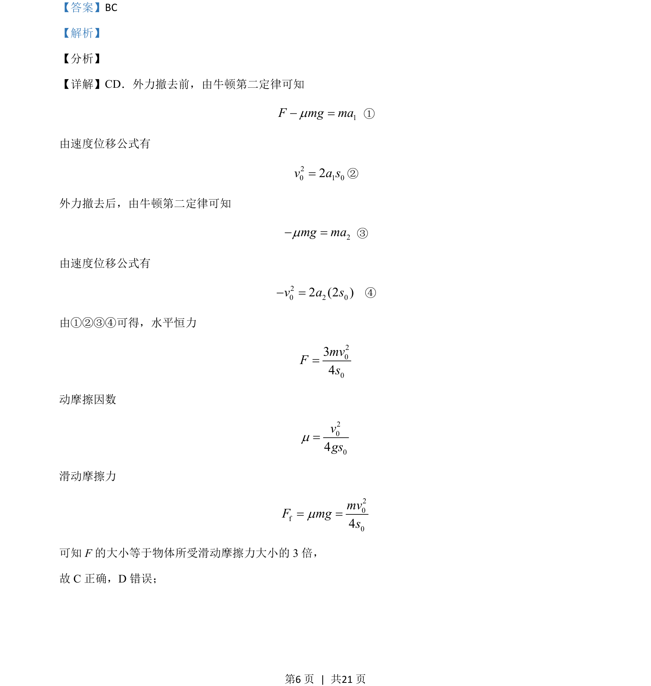
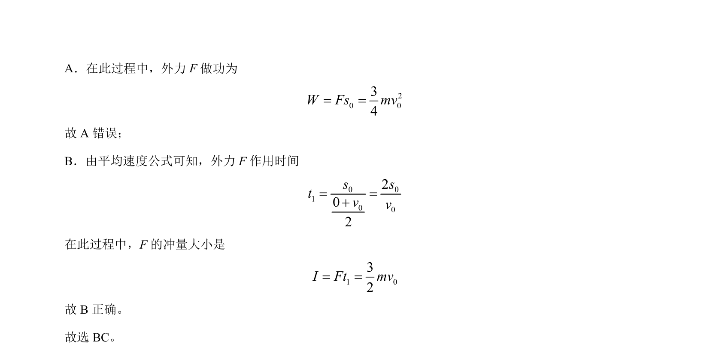

## 题面

## 摘要

该题考查牛顿运动定律与运动学公式结合求解力、功和冲量，涉及多过程运动分析。

## 关联考点

- [[229-牛顿第二定律|牛顿第二定律]]
- [[215-匀变速直线运动|匀变速直线运动]]
- [[062-功-物理|功]]
- [[345-冲量|冲量]]

## 答案与解析

> 📄 原 PDF 第 5 页：`素材/真题/吉林/2008-2024·（吉林）物理高考真题/2021年高考物理试卷（全国乙卷）（解析卷）.pdf`
