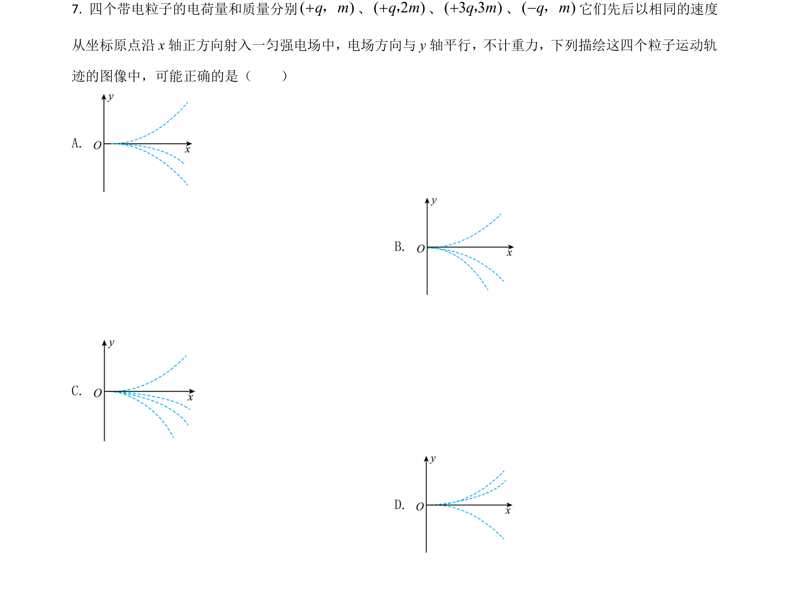
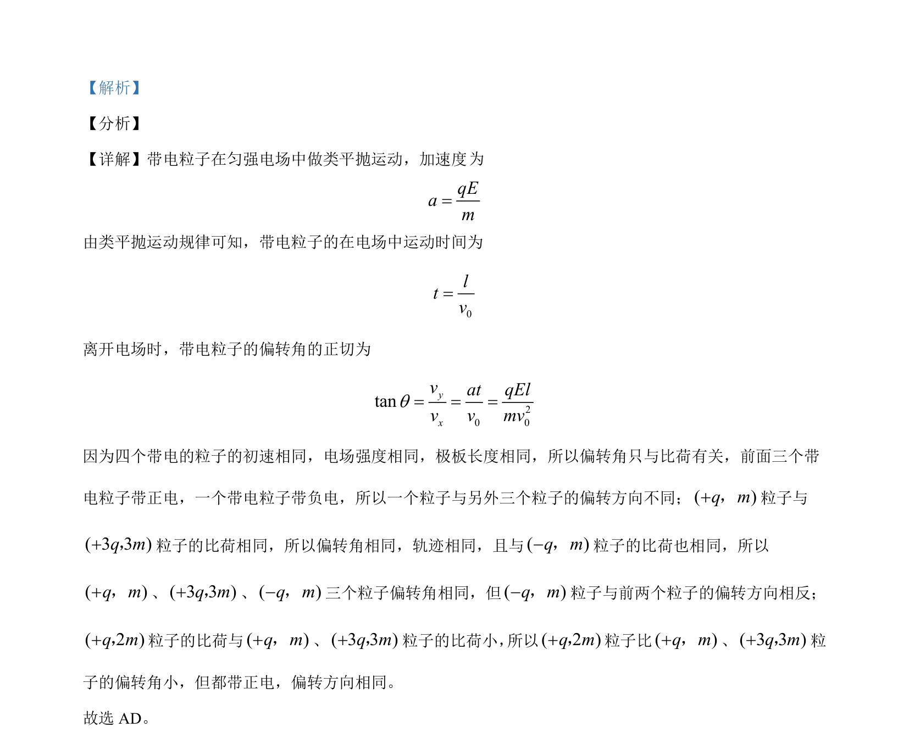

## 题面

## 摘要

带电粒子在匀强电场中做类平抛运动，通过比较比荷分析偏转角及方向。

## 关联考点

- [[597-带电粒子在电场中的偏转|带电粒子在电场中的偏转]]
- [[488-类平抛运动|类平抛运动]]
- [[634-比荷|比荷]]
- [[737-运动轨迹分析|运动轨迹分析]]

## 答案与解析

> 📄 原 PDF 第 7 页：`素材/真题/吉林/2008-2024·（吉林）物理高考真题/2021年高考物理试卷（全国乙卷）（解析卷）.pdf`
