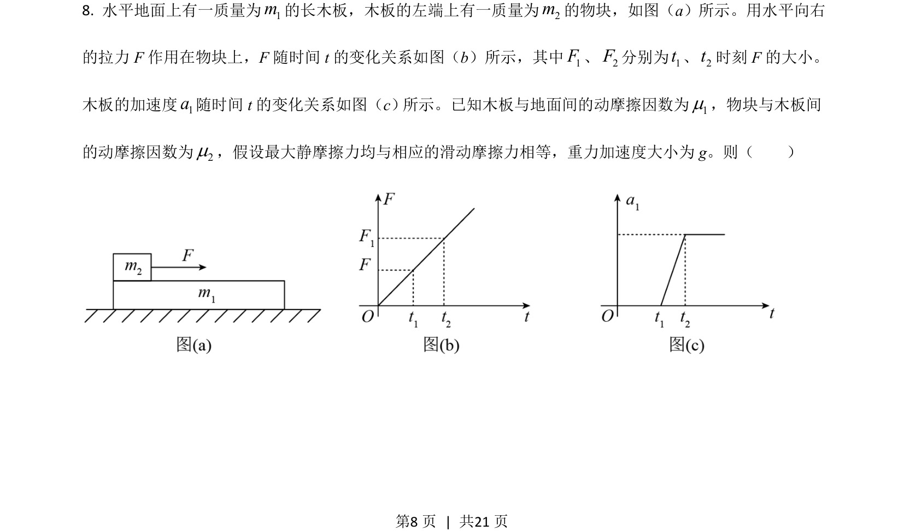

## 题面

## 摘要

本题通过滑块-木板模型考查牛顿第二定律与摩擦力在相对滑动临界条件中的应用。

## 关联考点

- [[229-牛顿第二定律|牛顿第二定律]]
- [[081-摩擦力|摩擦力]]
- [[整体法与隔离法]]
- [[临界条件]]

## 答案与解析

> 📄 原 PDF 第 8 页：`素材/真题/吉林/2008-2024·（吉林）物理高考真题/2021年高考物理试卷（全国乙卷）（解析卷）.pdf`
