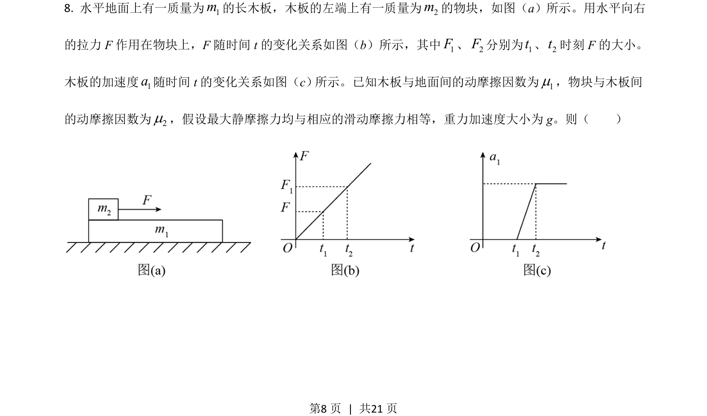
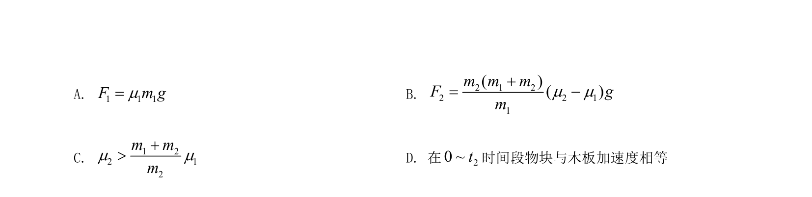
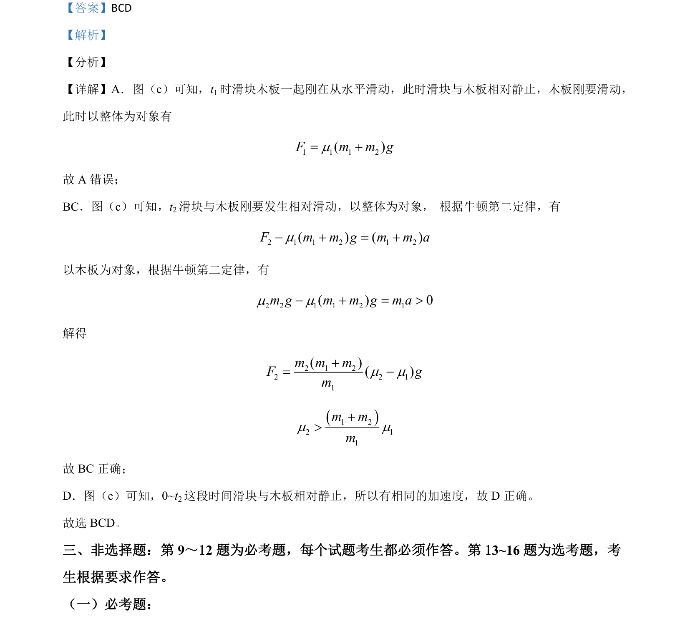

## 题面

## 摘要

本题通过滑块-木板模型考查牛顿第二定律与摩擦力在相对滑动临界条件中的应用。

## 关联考点

- [[229-牛顿第二定律|牛顿第二定律]]
- [[081-摩擦力|摩擦力]]
- [[474-整体法与隔离法|整体法与隔离法]]
- [[506-临界条件|临界条件]]

## 答案与解析

> 📄 原 PDF 第 8 页：`素材/真题/吉林/2008-2024·（吉林）物理高考真题/2021年高考物理试卷（全国乙卷）（解析卷）.pdf`

<!-- 题干文本-start -->
## 题干文本
8. 水平地面上有一质量为1m的长木板，木板的左端上有一质量为2m的物块，如图（a）所示。用水平向右
的拉力 F作用在物块上，F随时间 t的变化关系如图（b）所示，其中1F、2F分别为1t、2t时刻 F的大小。
木板的加速度1a随时间 t的变化关系如图（c） 所示。已知木板与地面间的动摩擦因数为1m，物块与木板间
的动摩擦因数为2m，假设最大静摩擦力均与相应的滑动摩擦力相等，重力加速度大小为 g。则（　　）
为
<!-- 题干文本-end -->

<!-- 解析文本-start -->
## 解析文本

<!-- 解析文本-end -->
