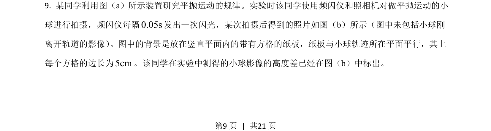
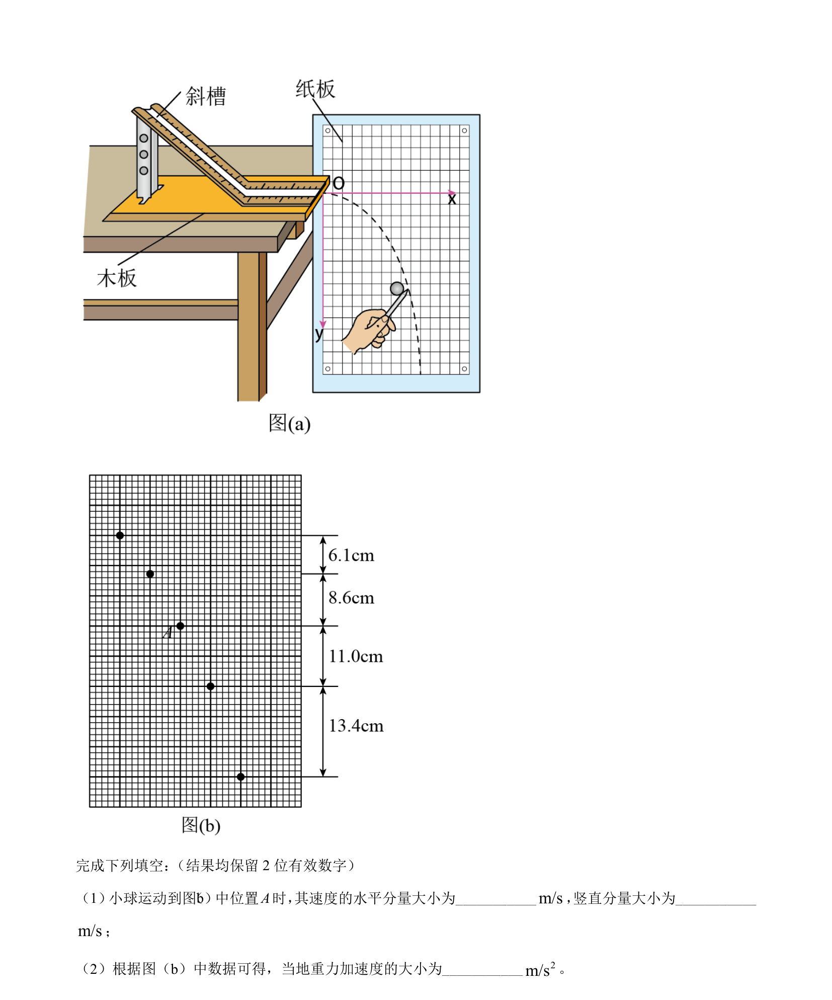
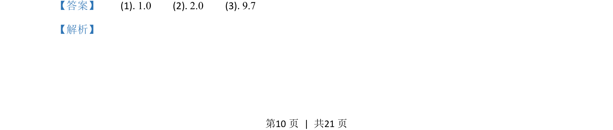
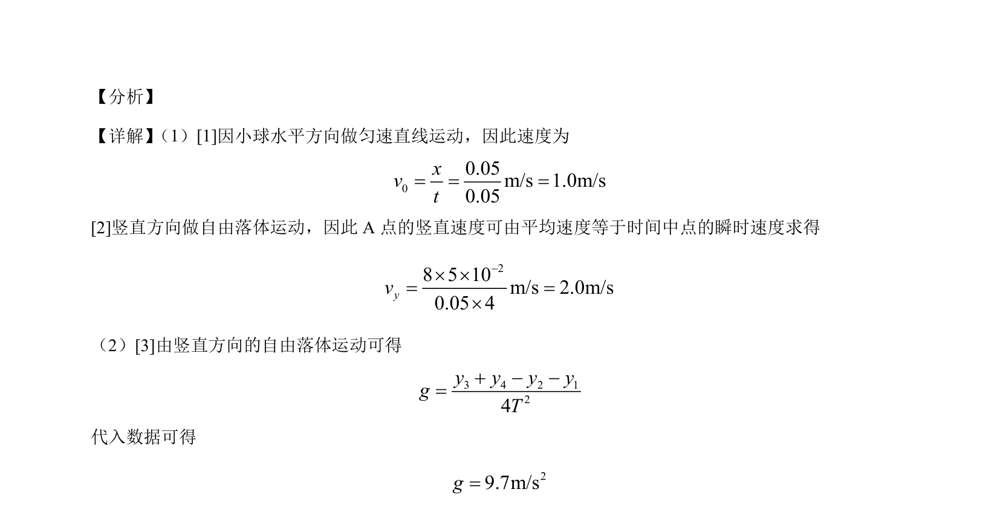

## 题面

## 摘要

平抛运动分解为水平匀速和竖直自由落体计算速度与重力加速度

## 关联考点

- [[613-抛体运动|抛体运动]]
- [[731-运动分解|运动分解]]
- [[602-平均速度法|平均速度法]]
- [[740-逐差法|逐差法]]

## 答案与解析

> 📄 原 PDF 第 9 页：`素材/真题/吉林/2008-2024·（吉林）物理高考真题/2021年高考物理试卷（全国乙卷）（解析卷）.pdf`
