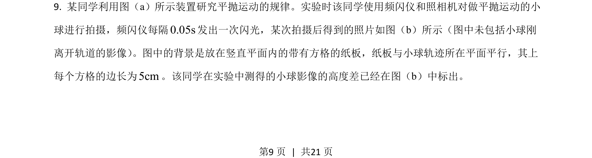
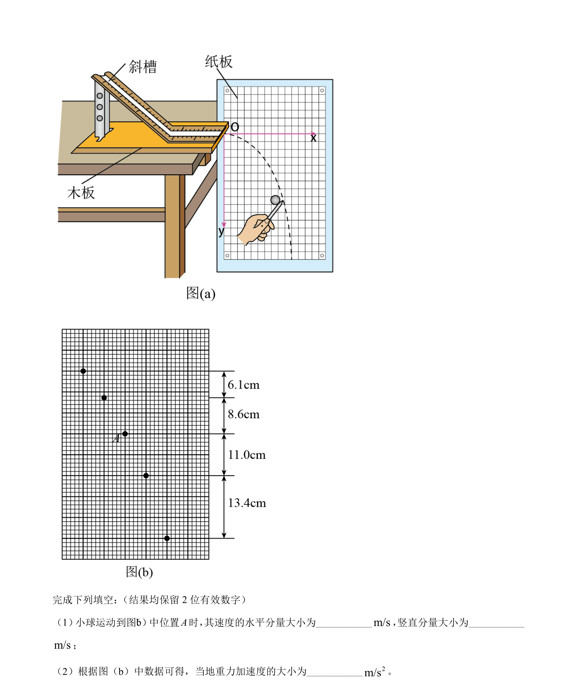
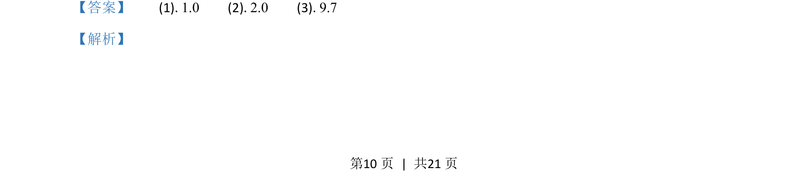
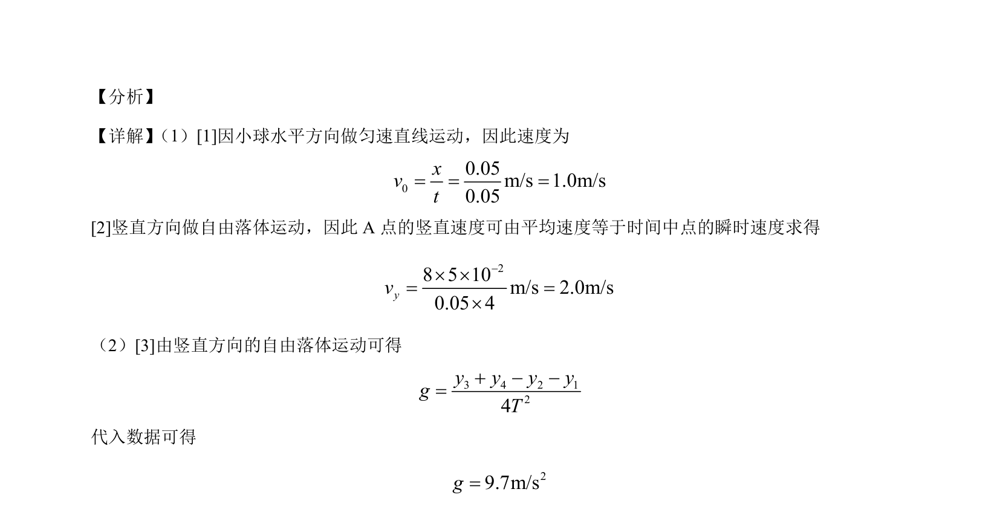

## 题面

## 摘要

平抛运动分解为水平匀速和竖直自由落体计算速度与重力加速度

## 关联考点

- [[613-抛体运动|抛体运动]]
- [[731-运动分解|运动分解]]
- [[602-平均速度法|平均速度法]]
- [[740-逐差法|逐差法]]

## 答案与解析

> 📄 原 PDF 第 9 页：`素材/真题/吉林/2008-2024·（吉林）物理高考真题/2021年高考物理试卷（全国乙卷）（解析卷）.pdf`

<!-- 题干文本-start -->
## 题干文本
9. 某同学利用图（a）所示装置研究平抛运动的规律。实验时该同学使用频闪仪和照相机对做平抛运动的小
球进行拍摄，频闪仪每隔0.05s发出一次闪光，某次拍摄后得到的照片如图（b）所示（图中未包括小球刚
离开轨道的影像） 。图中的背景是放在竖直平面内的带有方格的纸板，纸板与小球轨迹所在平面平行，其上
每个方格的边长为5cm。该同学在实验中测得的小球影像的高度差已经在图（b）中标出。
<!-- 题干文本-end -->

<!-- 解析文本-start -->
## 解析文本

<!-- 解析文本-end -->
