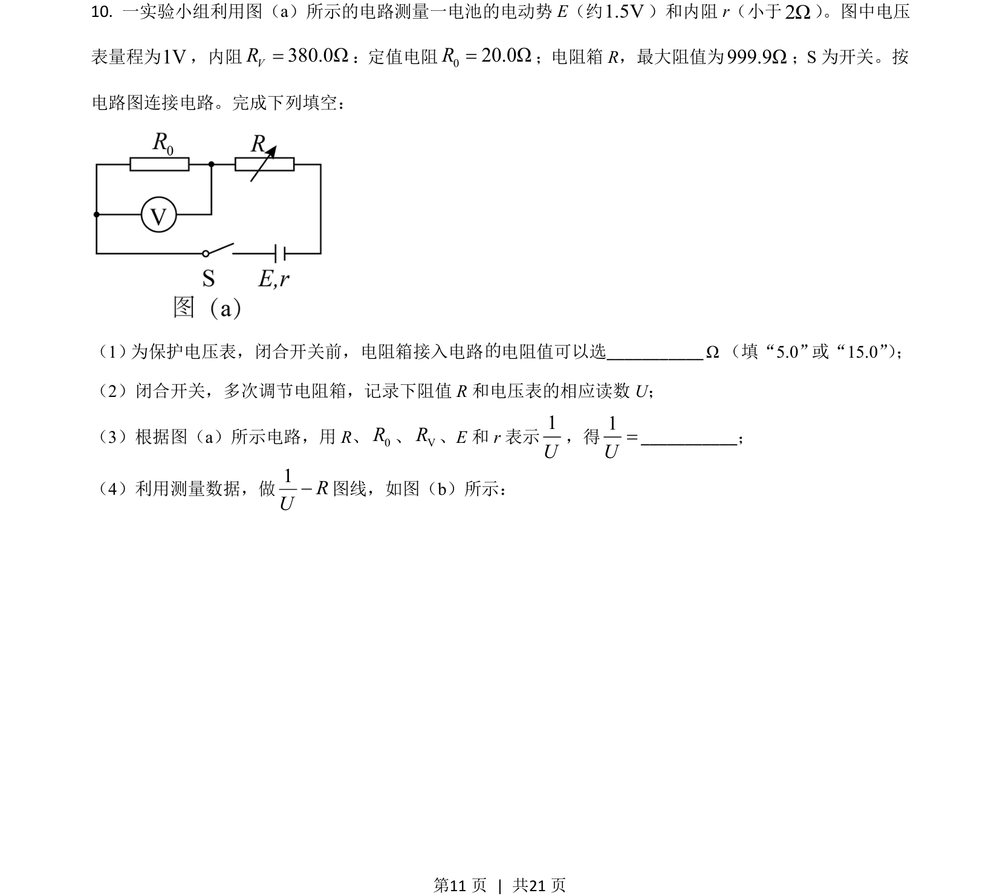
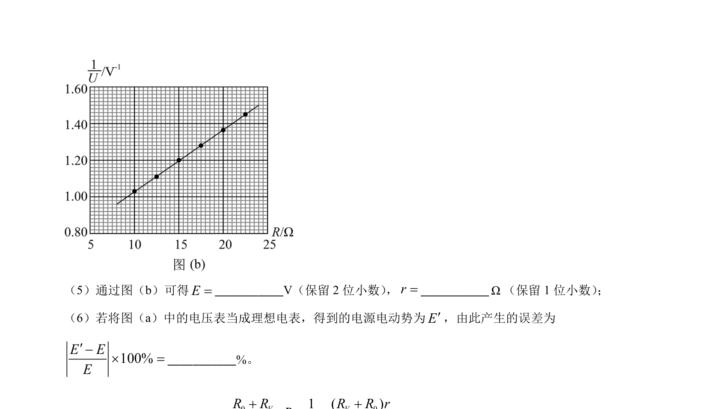
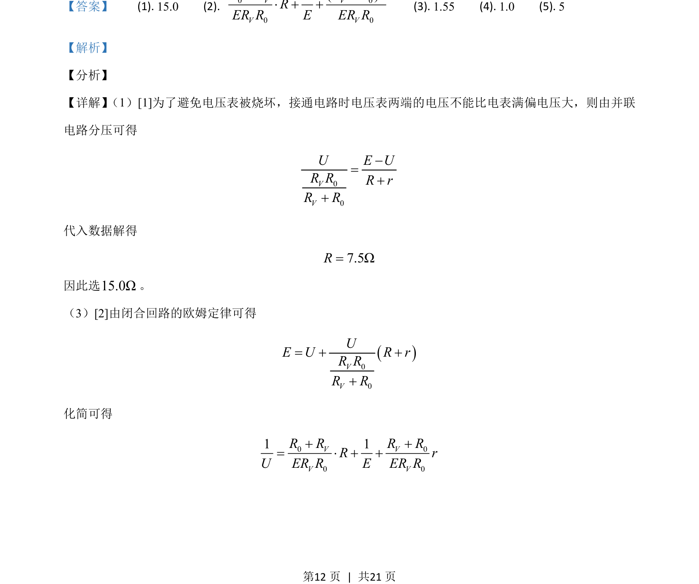
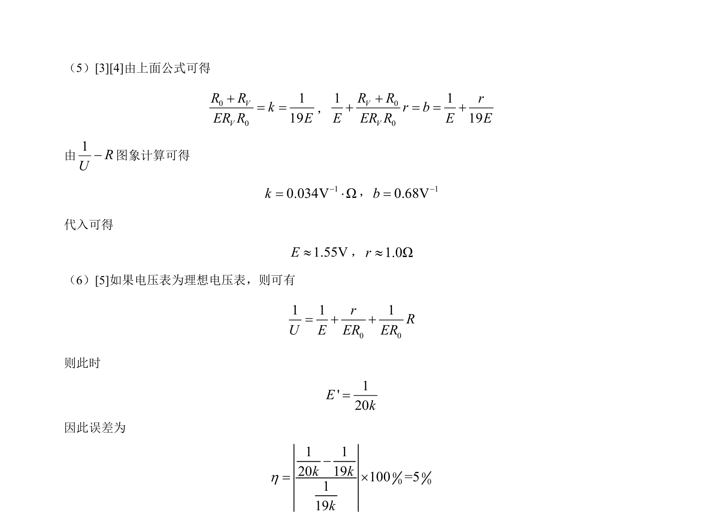

## 题面

## 摘要

测量电源电动势和内阻实验,涉及电表保护、闭合电路欧姆定律及图像法数据处理

## 关联考点

- [[332-闭合电路欧姆定律|闭合电路欧姆定律]]
- [[565-图像法|图像法]]
- [[725-误差分析|误差分析]]

## 答案与解析

> 📄 原 PDF 第 11 页：`素材/真题/吉林/2008-2024·（吉林）物理高考真题/2021年高考物理试卷（全国乙卷）（解析卷）.pdf`
