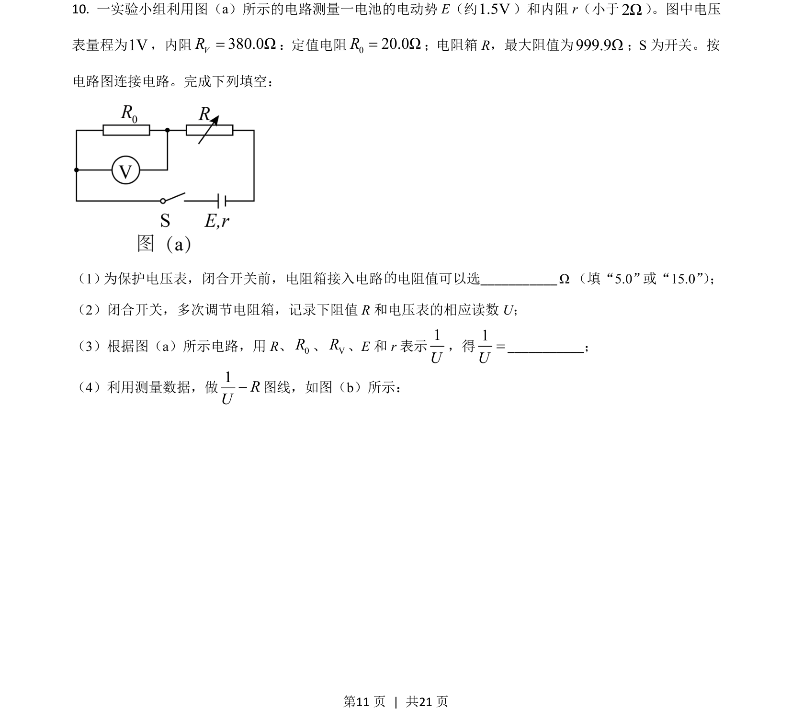
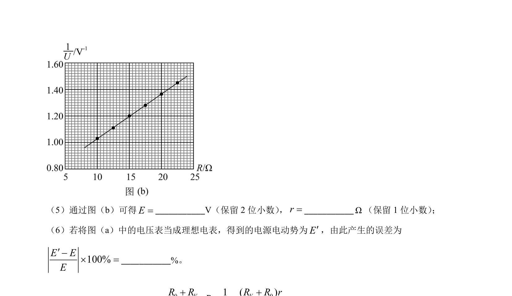
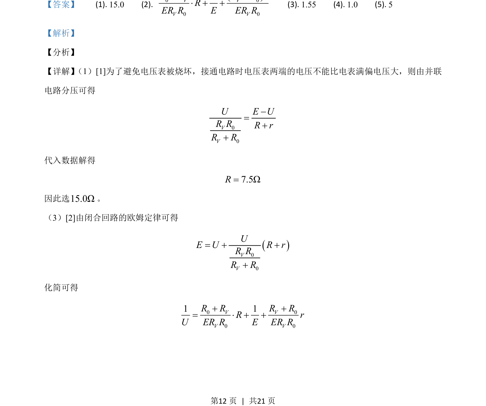
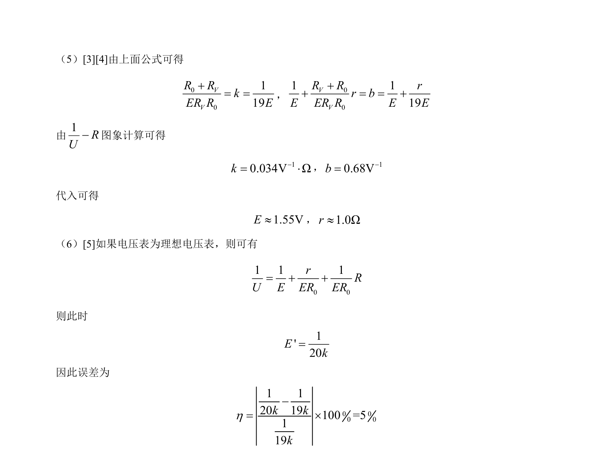

## 题面

## 摘要

测量电源电动势和内阻实验,涉及电表保护、闭合电路欧姆定律及图像法数据处理

## 关联考点

- [[332-闭合电路欧姆定律|闭合电路欧姆定律]]
- [[565-图像法|图像法]]
- [[724-误差分析|误差分析]]

## 答案与解析

> 📄 原 PDF 第 11 页：`素材/真题/吉林/2008-2024·（吉林）物理高考真题/2021年高考物理试卷（全国乙卷）（解析卷）.pdf`

<!-- 题干文本-start -->
## 题干文本
10. 一实验小组利用图（a）所示的电路测量一电池的电动势 E（约1.5V）和内阻 r（小于2Ω） 。图中电压
表量程为1V，内阻380.0ΩVR=： 定值电阻020.0ΩR=； 电阻箱R，最大阻值为999.9Ω；S 为开关。按
电路图连接电路。完成下列填空：
（1）为保护电压表，闭合开关前，电阻箱接入电路 电阻值可以选 ___________Ω（填“5.0”或“15.0”） ；
（2）闭合开关，多次调节电阻箱，记录下阻值 R和电压表的相应读数 U；
（3）根据图（a）所示电路，用 R、0R、VR、E和 r 表示1U
，得1U=___________；
（4）利用测量数据，做1RU-图线，如图（b）所示：
的
<!-- 题干文本-end -->

<!-- 解析文本-start -->
## 解析文本

<!-- 解析文本-end -->
