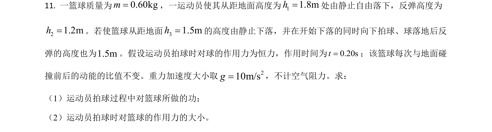
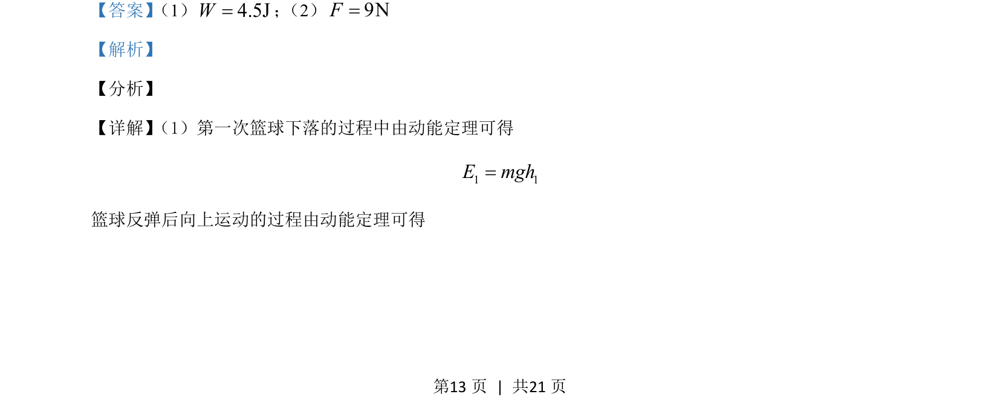
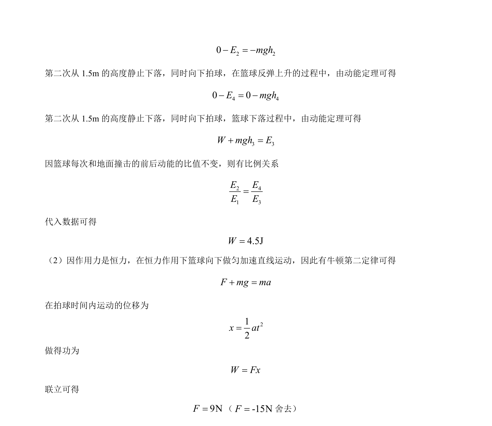

## 题面

## 摘要

本题通过动能定理和牛顿定律分析篮球下落反弹过程，涉及恒力做功与比例关系。

## 关联考点

- [[251-动能定理|动能定理]]
- [[229-牛顿第二定律|牛顿第二定律]]
- [[功的计算]]

## 答案与解析

> 📄 原 PDF 第 13 页：`素材/真题/吉林/2008-2024·（吉林）物理高考真题/2021年高考物理试卷（全国乙卷）（解析卷）.pdf`
