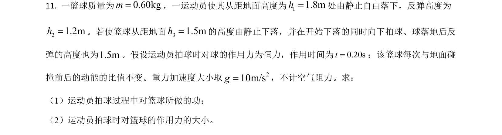
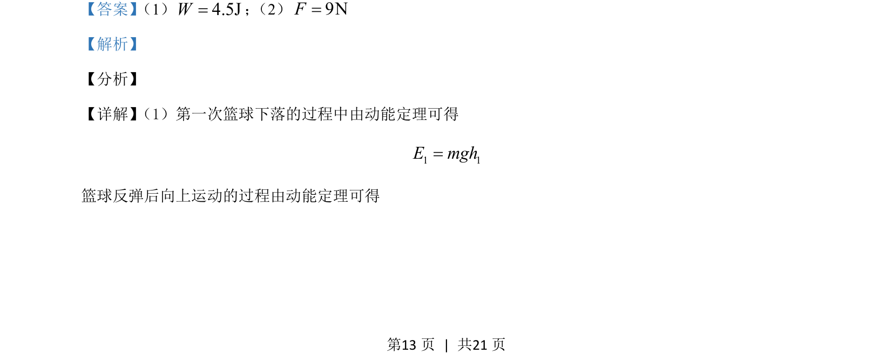
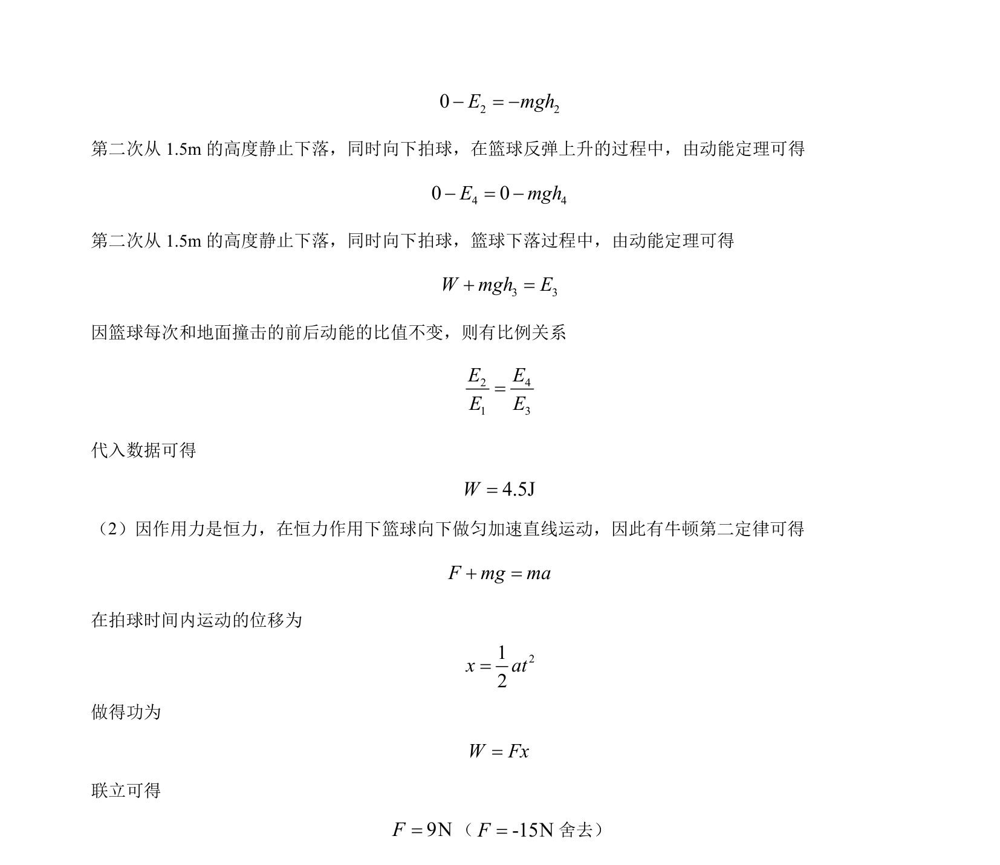

## 题面

## 摘要

本题通过动能定理和牛顿定律分析篮球下落反弹过程，涉及恒力做功与比例关系。

## 关联考点

- [[251-动能定理|动能定理]]
- [[229-牛顿第二定律|牛顿第二定律]]
- [[754-功的计算|功的计算]]

## 答案与解析

> 📄 原 PDF 第 13 页：`素材/真题/吉林/2008-2024·（吉林）物理高考真题/2021年高考物理试卷（全国乙卷）（解析卷）.pdf`

<!-- 题干文本-start -->
## 题干文本
11. 一篮球质量为0.60kgm=，一运动员使其从距地面高度为11.8mh=处由静止自由落下，反弹高度为
21.2mh=。若使篮球从距地面31.5mh=的高度由静止下落，并在开始下落的同时向下拍球、球落地后反
弹的高度也为1.5m。假设运动员拍球时对球的作用力为恒力，作用时间为0.20st=；该篮球每次与地面碰
撞前后的动能的比值不变。重力加速度大小取 210m/sg=，不计空气阻力。求：
（1）运动员拍球过程中对篮球所做的功；
（2）运动员拍球时对篮球的作用力的大小。
<!-- 题干文本-end -->

<!-- 解析文本-start -->
## 解析文本
【答案】 （1）4.5JW=； （2）9NF=
【解析】
【分析】
【详解】 （1）第一次篮球下落的过程中由动能定理可得
1 1E mgh=
篮球反弹后向上运动的过程由动能定理可得
<!-- 解析文本-end -->
