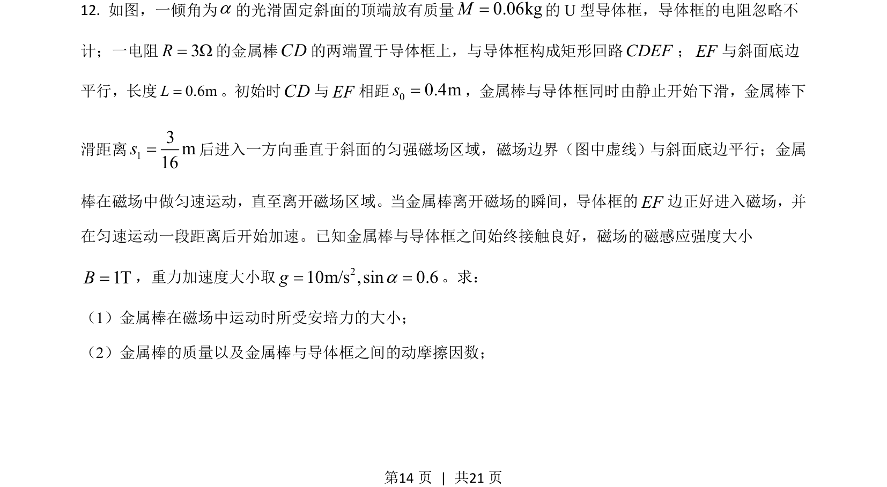
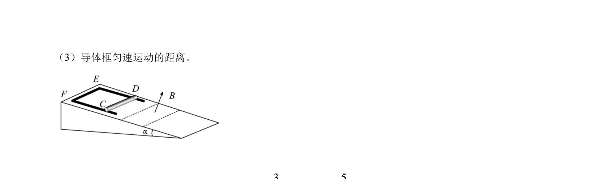
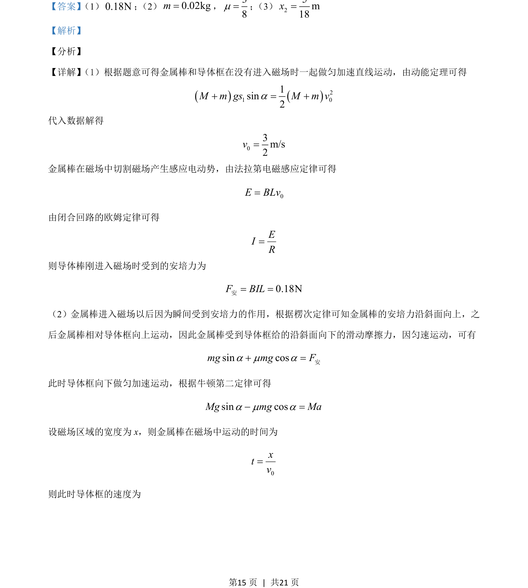
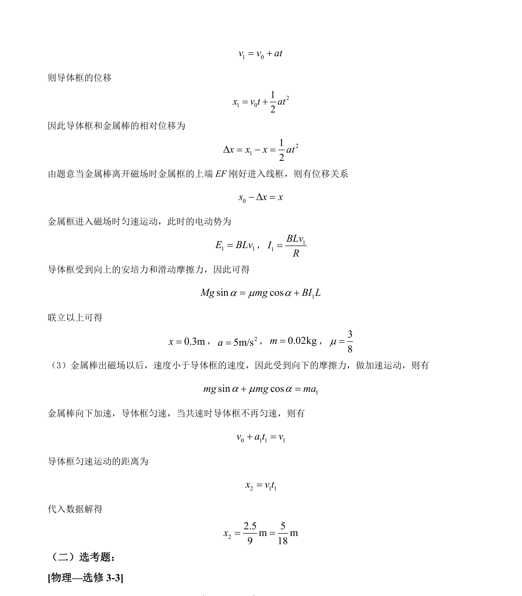

## 题面

## 摘要

本题通过电磁感应与力学综合模型，考查匀变速直线运动规律、安培力计算及运动学关系求解。

## 关联考点

- [[215-匀变速直线运动|匀变速直线运动]]
- [[229-牛顿第二定律|牛顿第二定律]]
- [[395-法拉第电磁感应定律|法拉第电磁感应定律]]
- [[代数方程求解]]

## 答案与解析

> 📄 原 PDF 第 14 页：`素材/真题/吉林/2008-2024·（吉林）物理高考真题/2021年高考物理试卷（全国乙卷）（解析卷）.pdf`
