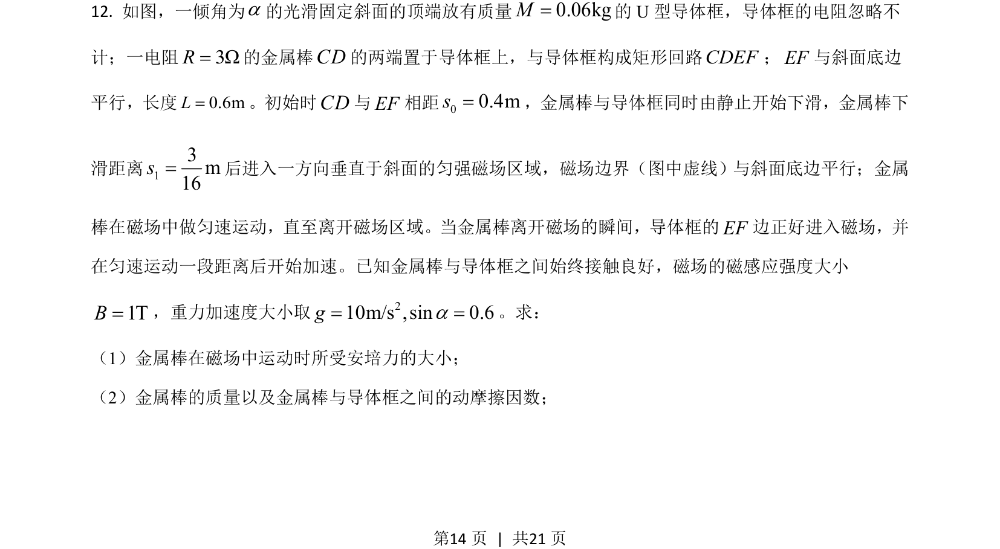
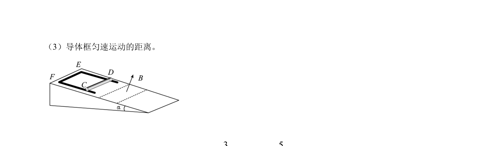
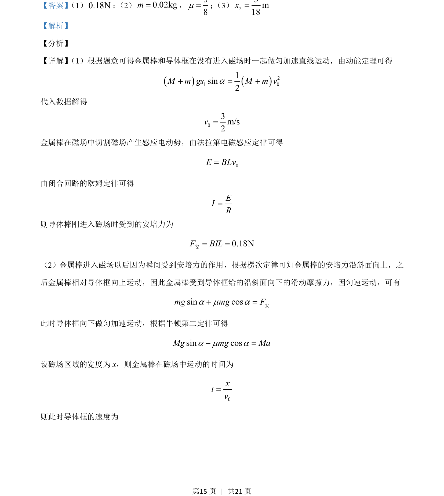
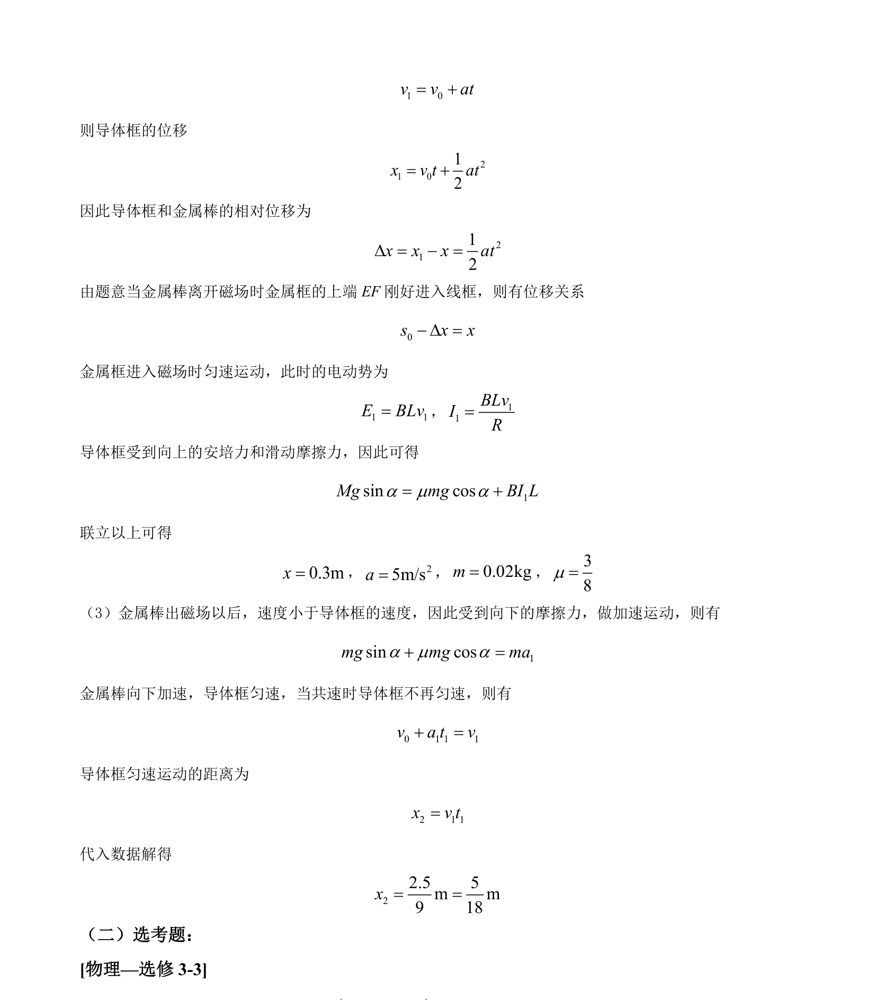

## 题面

## 摘要

导体棒与导体框在磁场中的电磁感应与力学综合问题，涉及多阶段运动分析。

## 关联考点

- [[175-电磁感应|电磁感应]]
- [[188-磁场对通电导体的作用|安培力]]
- [[229-牛顿第二定律|牛顿第二定律]]
- [[732-运动学|运动学]]

## 答案与解析

> 📄 原 PDF 第 14 页：`素材/真题/吉林/2008-2024·（吉林）物理高考真题/2021年高考物理试卷（全国乙卷）（解析卷）.pdf`

<!-- 题干文本-start -->
## 题干文本
12. 如图，一倾角为a的光滑固定斜面的顶端放有质量0.06kgM=的 U 型导体框，导体框的电阻忽略不
计；一电阻3ΩR=的金属棒CD的两端置于导体框上，与导体框构成矩形回路CDEF；EF与斜面底边
平行，长度0.6mL=。初始时CD与EF相距00.4ms=，金属棒与导体框同时由静止开始下滑，金属棒下
滑距离13m16s=后进入一方向垂直于斜面的匀强磁场区域，磁场边界（图中虚线） 与斜面底边平行；金属
棒在磁场中做匀速运动，直至离开磁场区域。当金属棒离开磁场的瞬间，导体框的EF边正好进入磁场，并
在匀速运动一段距离后开始加速。已知金属棒与导体框之间始终接触良好，磁场的磁感应强度大小
1TB=，重力加速度大小取 210m/s ,sin 0.6ga= =。求： 
（1）金属棒在磁场中运动时所受安培力的大小；
（2）金属棒的质量以及金属棒与导体框之间的动摩擦因数；
<!-- 题干文本-end -->

<!-- 解析文本-start -->
## 解析文本

<!-- 解析文本-end -->
