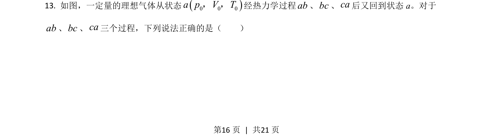

## 题面

## 摘要

本题通过理想气体 p-V 图分析热力学过程，判断气体吸放热与温度变化

## 关联考点

- [[440-热力学第一定律|热力学第一定律]]
- [[446-理想气体状态方程|理想气体状态方程]]
- [[图像面积分析]]

## 答案与解析

> 📄 原 PDF 第 16 页：`素材/真题/吉林/2008-2024·（吉林）物理高考真题/2021年高考物理试卷（全国乙卷）（解析卷）.pdf`
