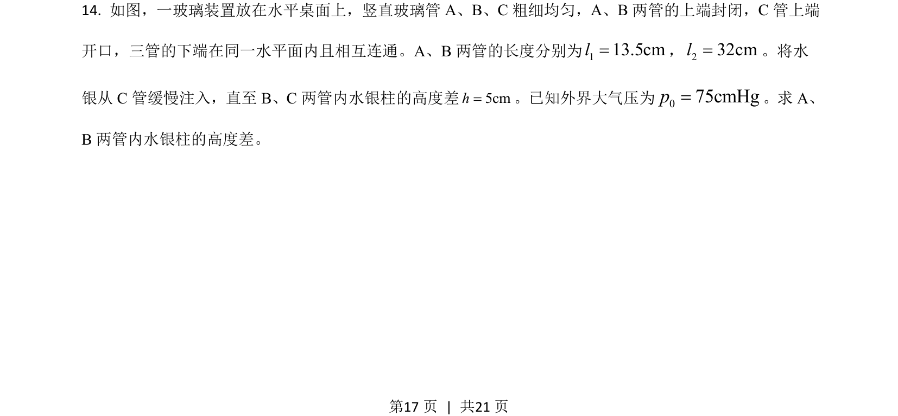
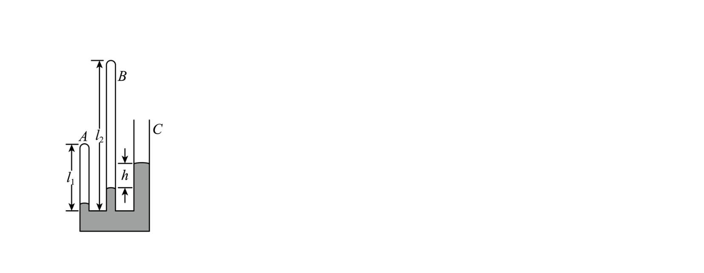
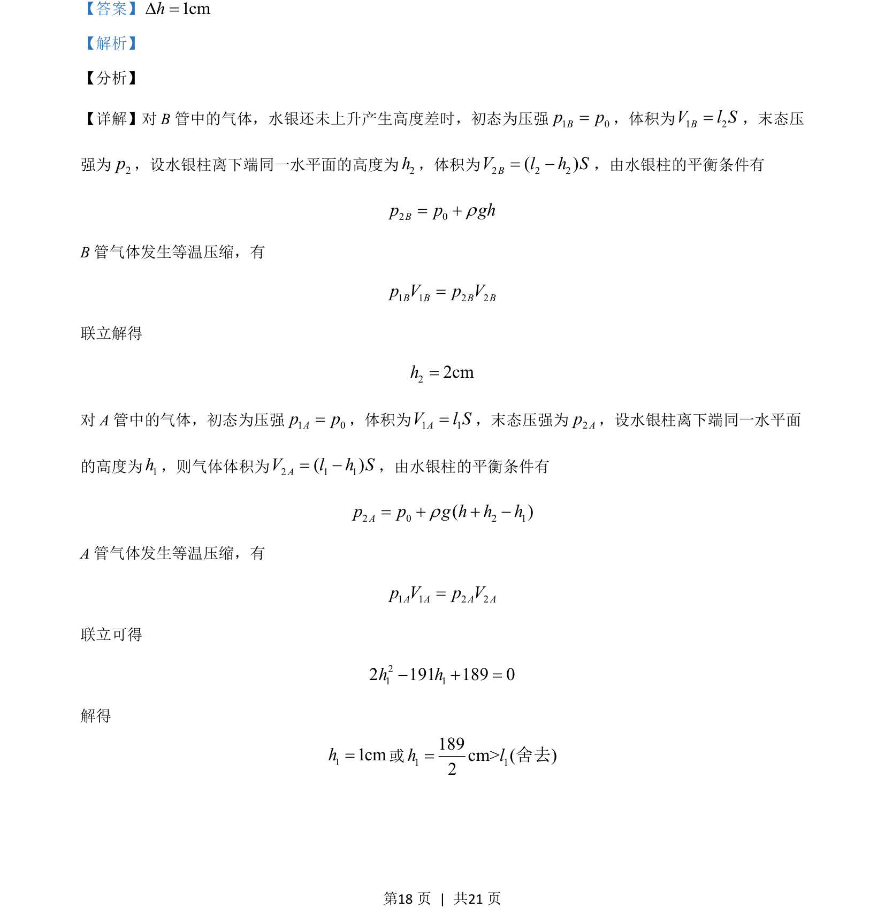
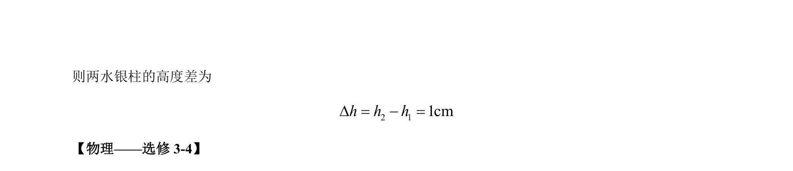

## 题面

## 摘要

本题通过水银柱平衡分析两封闭气体等温压缩后的高度差计算。

## 关联考点

- [[710-等温压缩|等温压缩]]
- [[549-压强平衡|压强平衡]]
- [[768-体积关系|体积关系]]

## 答案与解析

> 📄 原 PDF 第 17 页：`素材/真题/吉林/2008-2024·（吉林）物理高考真题/2021年高考物理试卷（全国乙卷）（解析卷）.pdf`

<!-- 题干文本-start -->
## 题干文本
14. 如图，一玻璃装置放在水平桌面上，竖直玻璃管 A、B、C粗细均匀，A、B两管的上端封闭，C管上端
开口，三管的下端在同一水平面内且相互连通。A、B两管的长度分别为113.5cml=，232cml=。将水
银从 C管缓慢注入，直至 B、C两管内水银柱的高度差5cmh=。已知外界大气压为075cmHgp=。求 A、
B两管内水银柱的高度差。
<!-- 题干文本-end -->

<!-- 解析文本-start -->
## 解析文本

<!-- 解析文本-end -->
