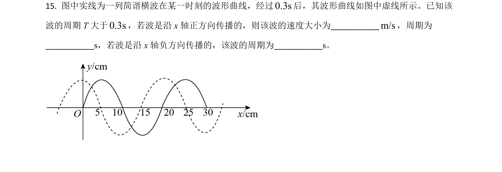
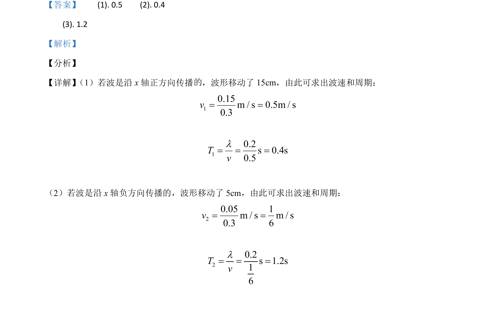

## 题面

## 摘要

根据波的传播方向，通过波形移动距离和时间求波速与周期。

## 关联考点

- [[362-机械波|机械波]]
- [[369-波速|波速]]
- [[261-周期|周期]]

## 答案与解析

> 📄 原 PDF 第 19 页：`素材/真题/吉林/2008-2024·（吉林）物理高考真题/2021年高考物理试卷（全国乙卷）（解析卷）.pdf`

<!-- 题干文本-start -->
## 题干文本
15. 图中实线为一列简谐横波在某一时刻的波形曲线，经过0.3s后，其波形曲线如图中虚线所示。已知该
波的周期 T 大于0.3s，若波是沿 x轴正方向传播的，则该波的速度大小为___________m/s，周期为
___________s，若波是沿 x轴负方向传播的，该波的周期为___________s。
<!-- 题干文本-end -->

<!-- 解析文本-start -->
## 解析文本
【答案】    (1). 0.5    (2). 0.4
    (3). 1.2
【解析】
【分析】
【详解】 （1）若波是沿 x轴正方向传播 ，波形移动了 15cm，由此可求出波速和周期：
10.15m / s 0.5m / s0.3v= =10.2s 0.4s0.5Tvl= = =
（2）若波是沿 x轴负方向传播的，波形移动了 5cm，由此可求出波速和周期：
20.05 1m / s m / s0.3 6v= =20.2s 1.2s16Tvl= = =
<!-- 解析文本-end -->
