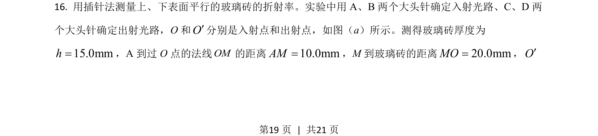
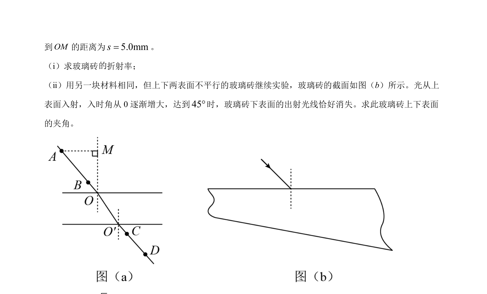
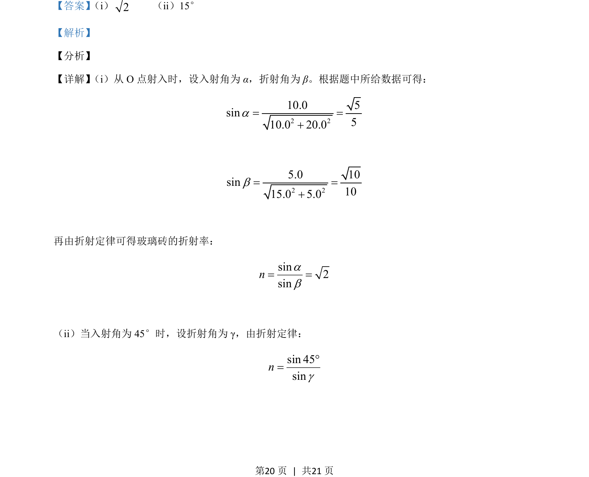
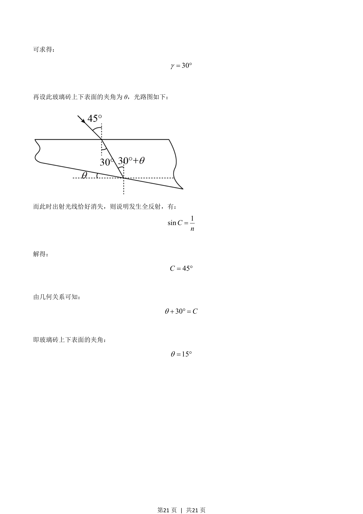

## 题面

## 摘要

考查光的折射定律与全反射，计算玻璃砖折射率及上下表面夹角

## 关联考点

- [[026-折射定律|折射定律]]
- [[360-折射率|折射率]]
- [[343-全反射|全反射]]
- [[336-临界角|临界角]]

## 答案与解析

> 📄 原 PDF 第 19 页：`素材/真题/吉林/2008-2024·（吉林）物理高考真题/2021年高考物理试卷（全国乙卷）（解析卷）.pdf`
