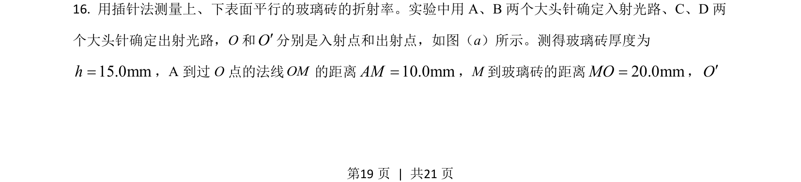
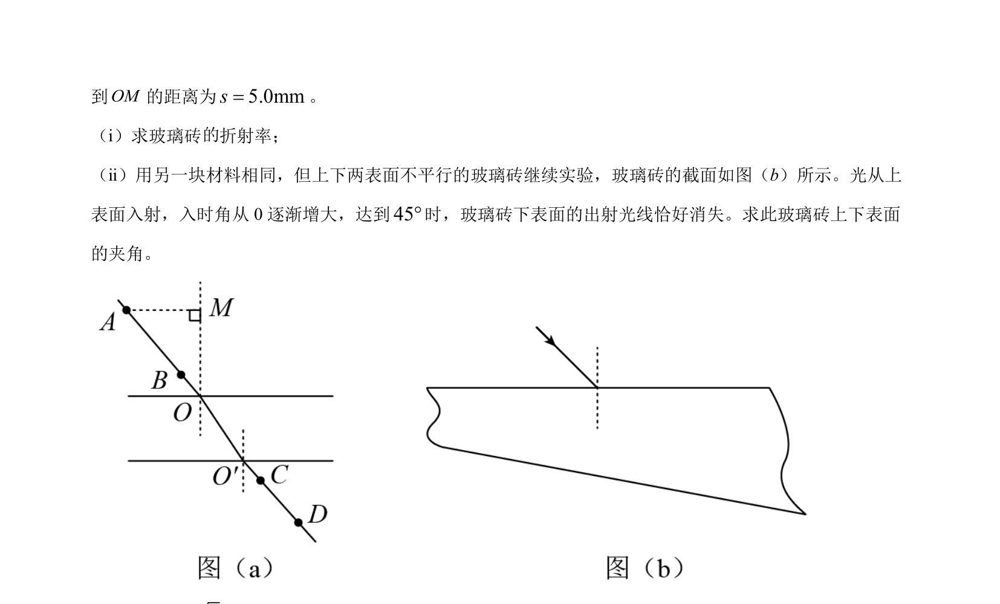
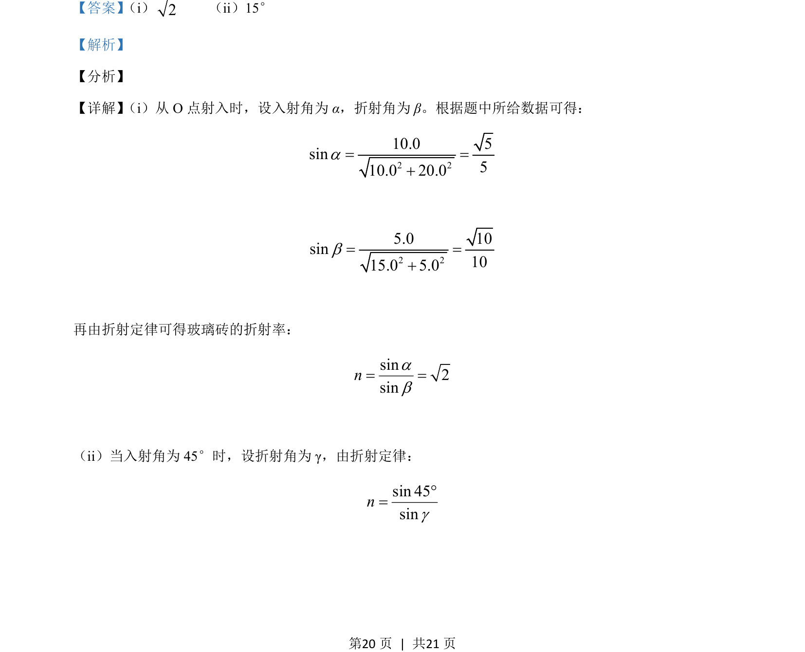
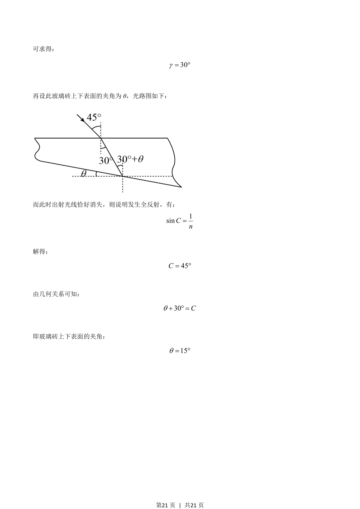

## 题面

## 摘要

考查光的折射定律与全反射，计算玻璃砖折射率及上下表面夹角

## 关联考点

- [[026-折射定律|折射定律]]
- [[360-折射率|折射率]]
- [[343-全反射|全反射]]
- [[336-临界角|临界角]]

## 答案与解析

> 📄 原 PDF 第 19 页：`素材/真题/吉林/2008-2024·（吉林）物理高考真题/2021年高考物理试卷（全国乙卷）（解析卷）.pdf`

<!-- 题干文本-start -->
## 题干文本
16. 用插针法测量上、下表面平行的玻璃砖的折射率。实验中用 A、B两个大头针确定入射光路、C、D 两
个大头针确定出射光路，O 和O¢分别是入射点和出射点，如图（a）所示。测得玻璃砖厚度为
15.0mmh=，A 到过 O 点的法线OM的距离10.0mmAM=，M 到玻璃砖的距离20.0mmMO=，O¢
的
<!-- 题干文本-end -->

<!-- 解析文本-start -->
## 解析文本

<!-- 解析文本-end -->
