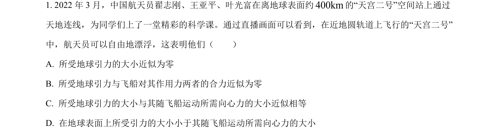
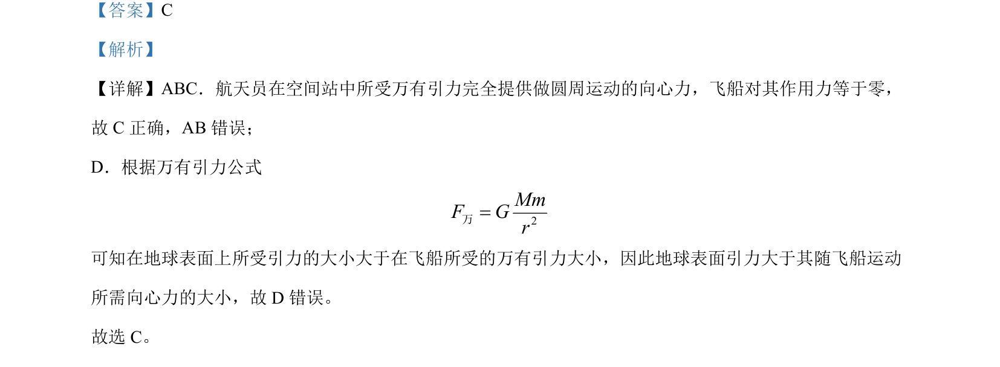

## 题面

## 摘要

航天员在空间站中万有引力提供向心力，飞船对其作用力为零。

## 关联考点

- [[501-万有引力公式|万有引力公式]]
- [[256-向心力|向心力]]
- [[258-圆周运动|圆周运动]]

## 答案与解析

> 📄 原 PDF 第 1 页：`素材/真题/吉林/2008-2024·（吉林）物理高考真题/2022年高考物理试卷（全国乙卷）（解析卷）.pdf`

<!-- 题干文本-start -->
## 题干文本
1. 2022 年 3 月，中国航天员翟志刚、王亚平、叶光富在离地球表面约400km的“天宫二号”空间站上通过
天地连线，为同学们上了一堂精彩的科学课。通过直播画面可以看到，在近地圆轨道上飞行的“天宫二号”
中，航天员可以自由地漂浮，这表明他们（　　）
A. 所受地球引力的大小近似为零
B. 所受地球引力与飞船对其作用力两者的合力近似为零
C. 所受地球引力的大小与其随飞船运动所需向心力的大小近似相等
D. 在地球表面上所受引力的大小小于其随飞船运动所需向心力的大小
<!-- 题干文本-end -->

<!-- 解析文本-start -->
## 解析文本
【答案】C
【解析】
【详解】ABC．航天员在空间站中所受万有引力完全提供做圆周运动的向心力，飞船对其作用力等于零，
故 C正确，AB 错误；
D．根据万有引力公式
2MmF Gr=万
可知在地球表面上所受引力的大小大于在飞船所受的万有引力大小，因此地球表面引力大于其随飞船运动
所需向心力的大小，故 D 错误。
故选 C。
<!-- 解析文本-end -->
