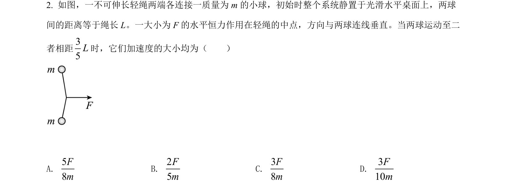
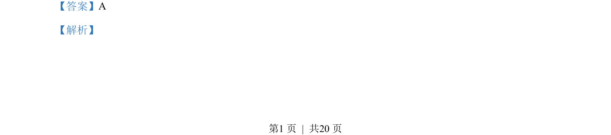
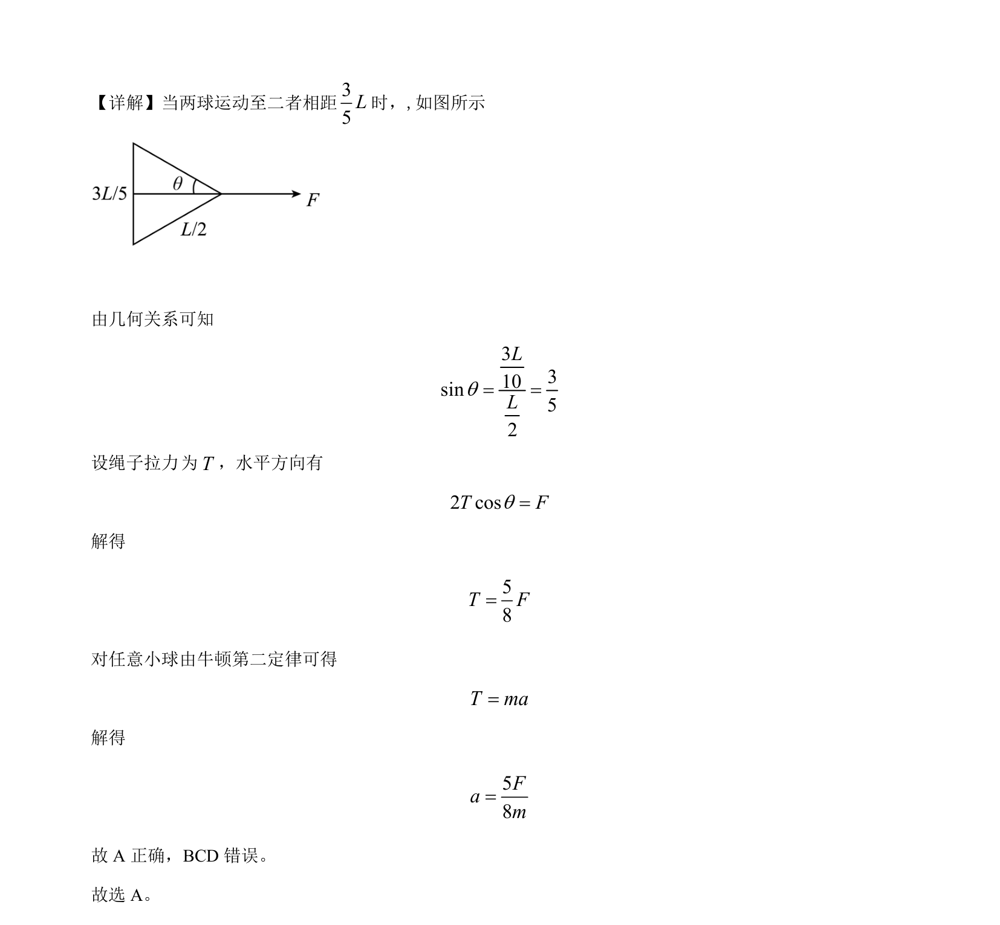

## 题面

## 摘要

两球运动中的力学分析，应用牛顿第二定律和几何关系求加速度。

## 关联考点

- [[力的合成与分解]]
- [[229-牛顿第二定律|牛顿第二定律]]
- [[208-共点力平衡|共点力平衡]]

## 答案与解析

> 📄 原 PDF 第 1 页：`素材/真题/吉林/2008-2024·（吉林）物理高考真题/2022年高考物理试卷（全国乙卷）（解析卷）.pdf`
