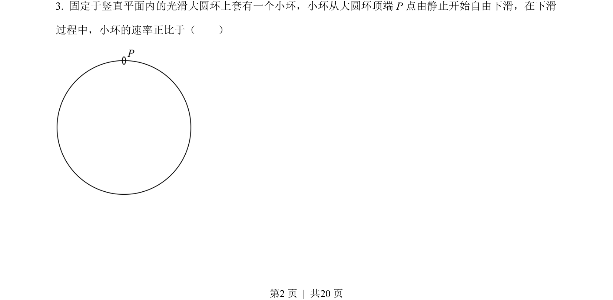
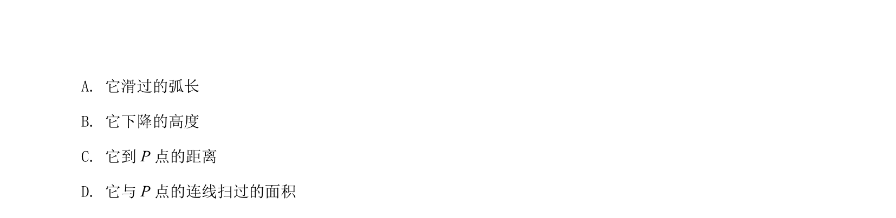
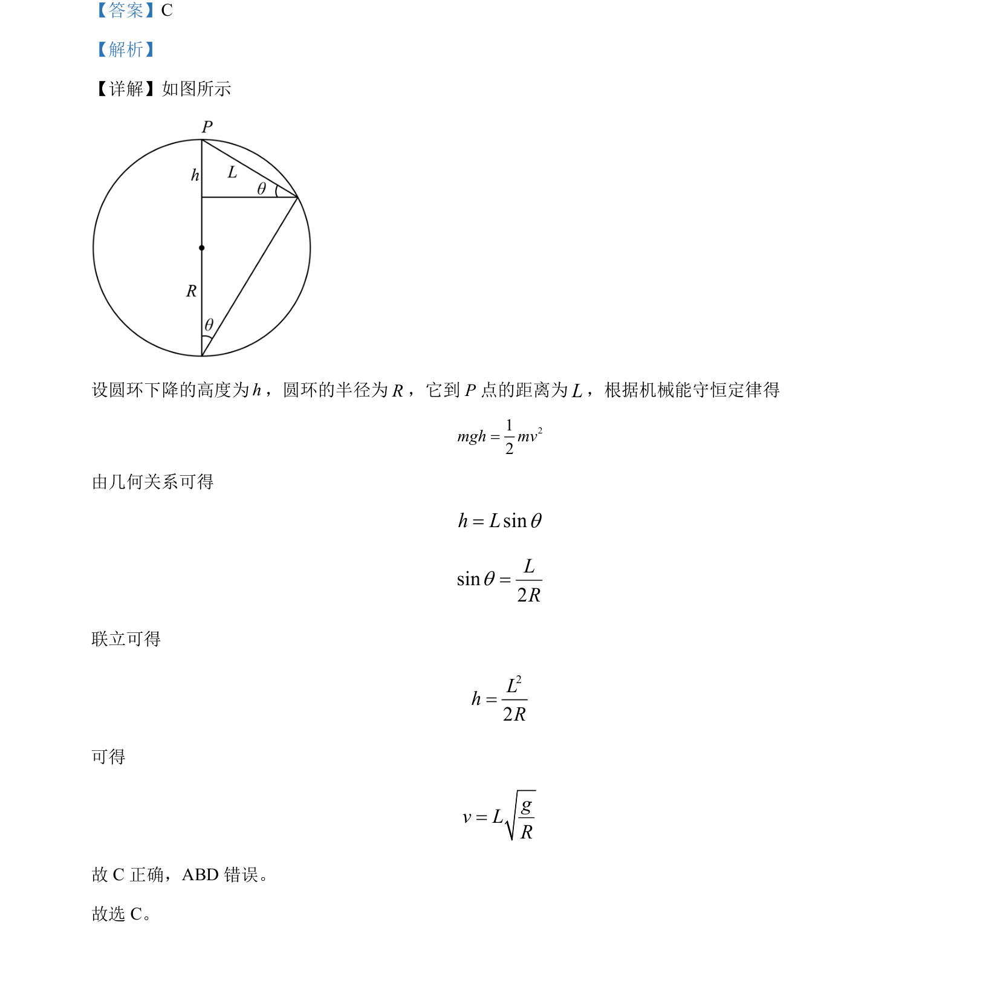

## 题面

## 摘要

圆环沿圆弧下降过程，利用机械能守恒和几何关系求解速度表达式。

## 关联考点

- [[085-机械能守恒-初中|机械能守恒定律]]
- [[456-几何关系|几何关系]]
- [[258-圆周运动|圆周运动]]

## 答案与解析

> 📄 原 PDF 第 2 页：`素材/真题/吉林/2008-2024·（吉林）物理高考真题/2022年高考物理试卷（全国乙卷）（解析卷）.pdf`
