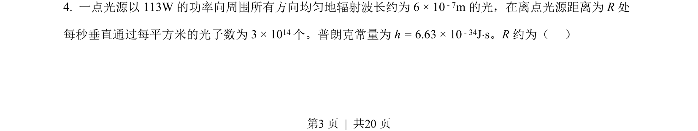
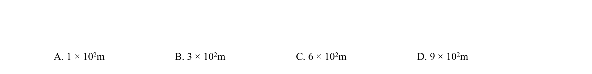
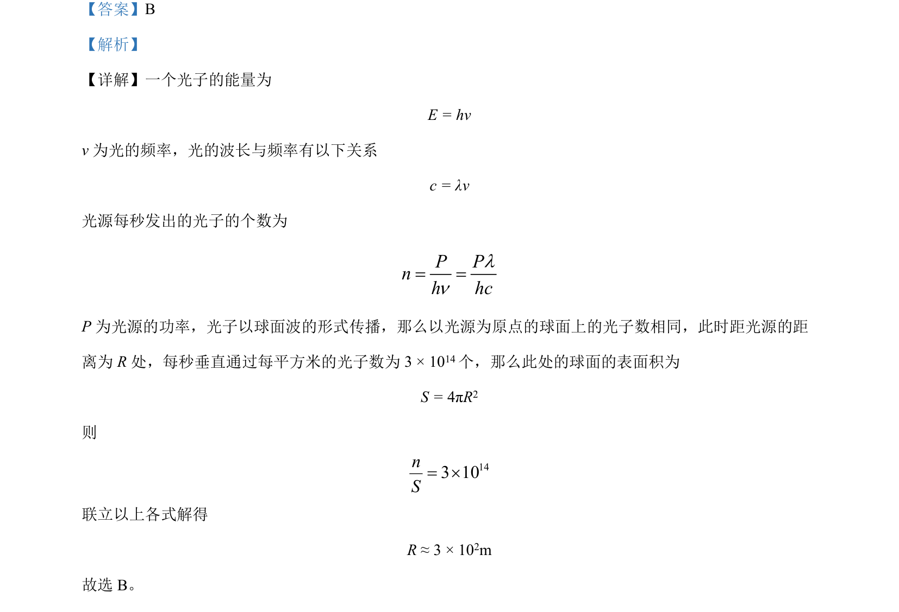

## 题面

## 摘要

该题考查光源功率与光子数的关系，结合球面波传播模型估算距离。

## 关联考点

- [[453-光子能量|光子能量]]
- [[479-波长与频率关系|波长与频率关系]]
- [[665-球面波传播|球面波传播]]
- [[517-光功率|光功率]]

## 答案与解析

> 📄 原 PDF 第 3 页：`素材/真题/吉林/2008-2024·（吉林）物理高考真题/2022年高考物理试卷（全国乙卷）（解析卷）.pdf`

<!-- 题干文本-start -->
## 题干文本
4. 一点光源以 113W的功率向周围所有方向均匀地辐射波长约为 6 × 10 - 7m的光，在离点光源距离为 R处
每秒垂直通过每平方米的光子数为 3 × 1014个。普朗克常量为 h = 6.63 × 10 - 34Js。R约为（   ）
<!-- 题干文本-end -->

<!-- 解析文本-start -->
## 解析文本

<!-- 解析文本-end -->
