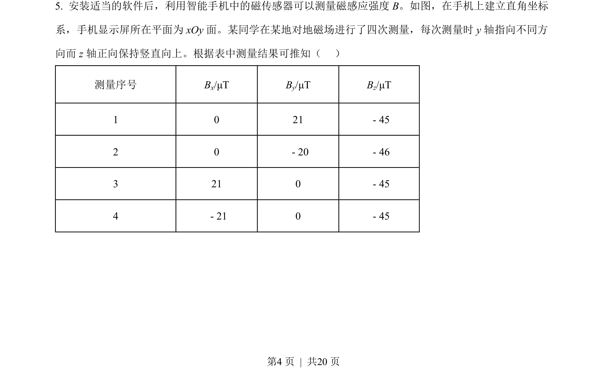
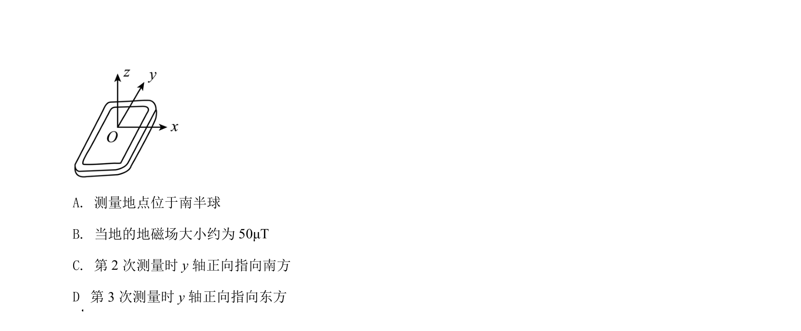
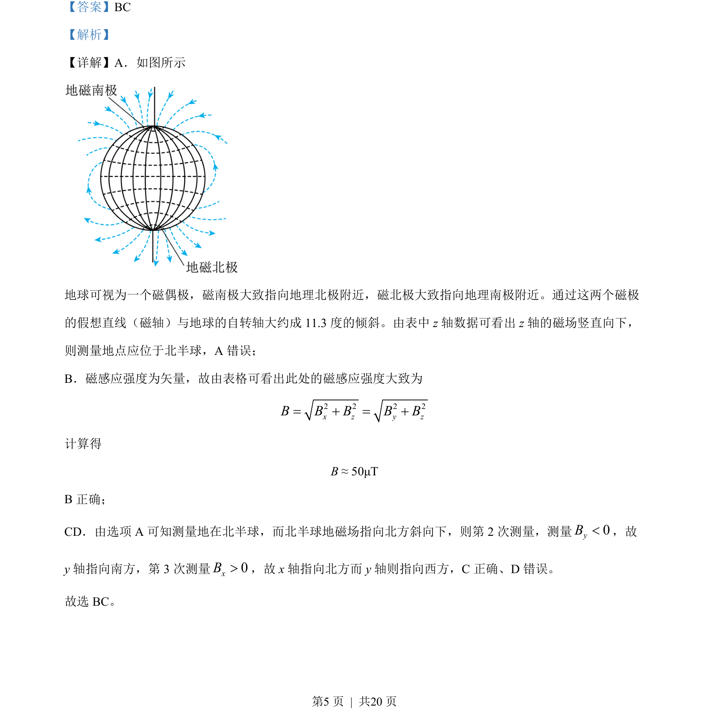

## 题面

## 摘要

本题通过地磁场数据表考查空间矢量分析及地理方位判断。

## 关联考点

- [[574-地磁场方向|地磁场方向]]
- [[702-矢量合成|矢量合成]]
- [[706-空间方位推理|空间方位推理]]

## 答案与解析

> 📄 原 PDF 第 4 页：`素材/真题/吉林/2008-2024·（吉林）物理高考真题/2022年高考物理试卷（全国乙卷）（解析卷）.pdf`
