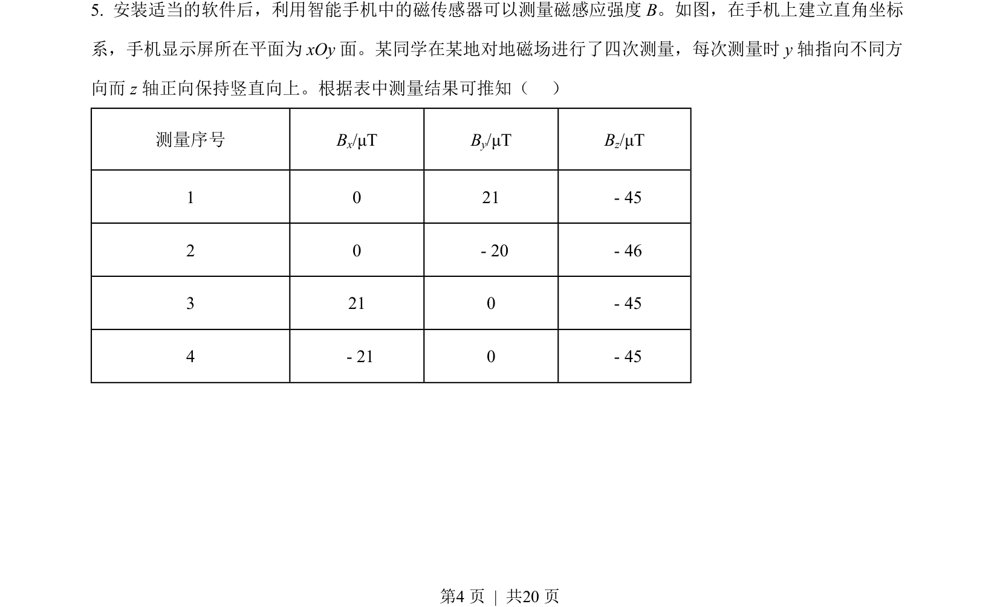
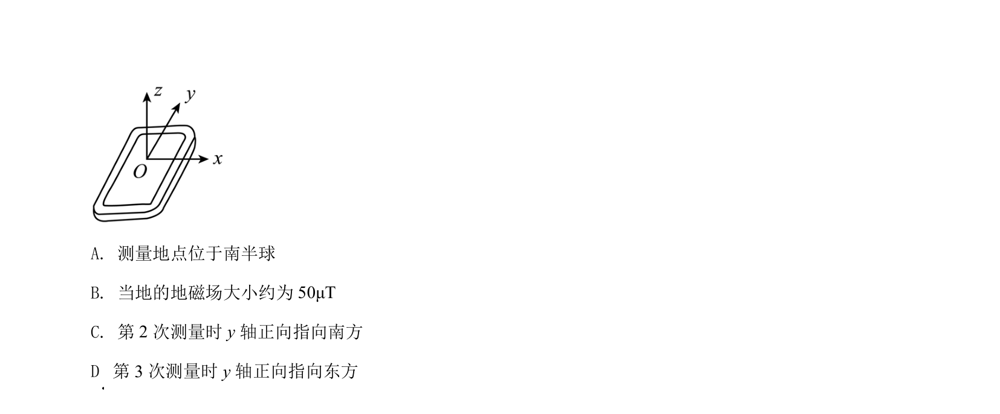
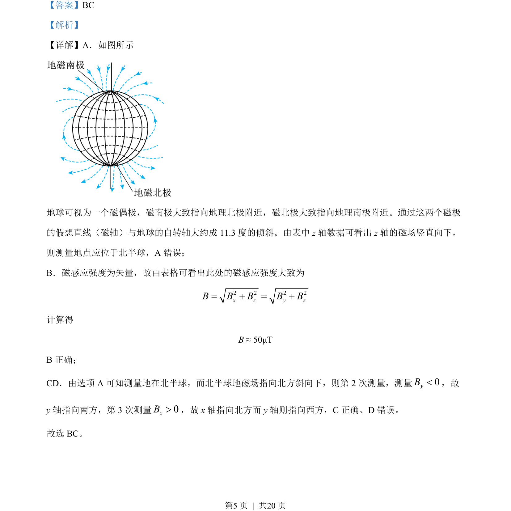

## 题面

## 摘要

本题通过地磁场数据表考查空间矢量分析及地理方位判断。

## 关联考点

- [[574-地磁场方向|地磁场方向]]
- [[701-矢量合成|矢量合成]]
- [[705-空间方位推理|空间方位推理]]

## 答案与解析

> 📄 原 PDF 第 4 页：`素材/真题/吉林/2008-2024·（吉林）物理高考真题/2022年高考物理试卷（全国乙卷）（解析卷）.pdf`

<!-- 题干文本-start -->
## 题干文本
5. 安装适当的软件后，利用智能手机中的磁传感器可以测量磁感应强度 B。如图，在手机上建立直角坐标
系，手机显示屏所在平面为 xOy面。某同学在某地对地磁场进行了四次测量，每次测量时 y轴指向不同方
向而 z 轴正向保持竖直向上。根据表中测量结果可推知（   ）
测量序号 Bx/μT By/μT Bz/μT
1 0 21  - 45
2 0  - 20  - 46
3 21 0  - 45
4  - 21 0  - 45
<!-- 题干文本-end -->

<!-- 解析文本-start -->
## 解析文本

<!-- 解析文本-end -->
