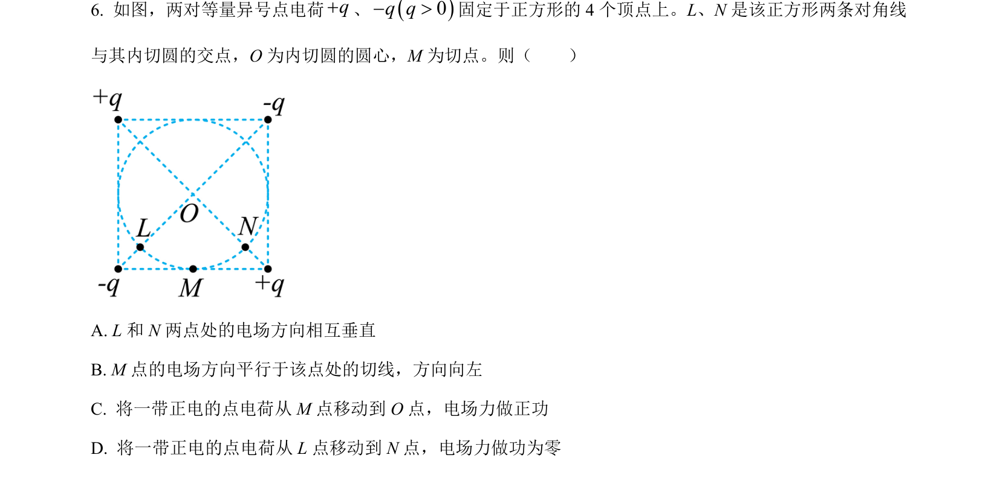
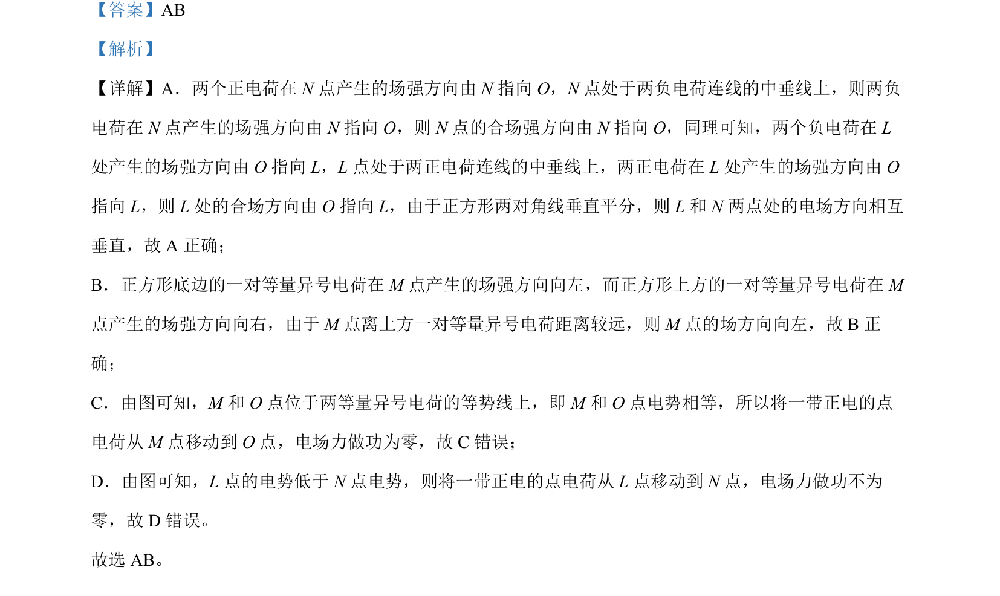

## 题面

## 摘要

本题通过分析正方形顶点电荷分布，判断各点场强方向、电势高低及电场力做功情况。

## 关联考点

- [[电场强度叠加]]
- [[等量异号电荷电场]]
- [[308-电势|电势]]
- [[电场力做功]]

## 答案与解析

> 📄 原 PDF 第 6 页：`素材/真题/吉林/2008-2024·（吉林）物理高考真题/2022年高考物理试卷（全国乙卷）（解析卷）.pdf`
