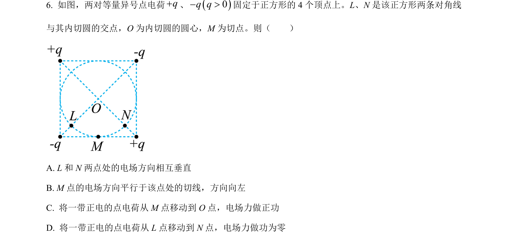
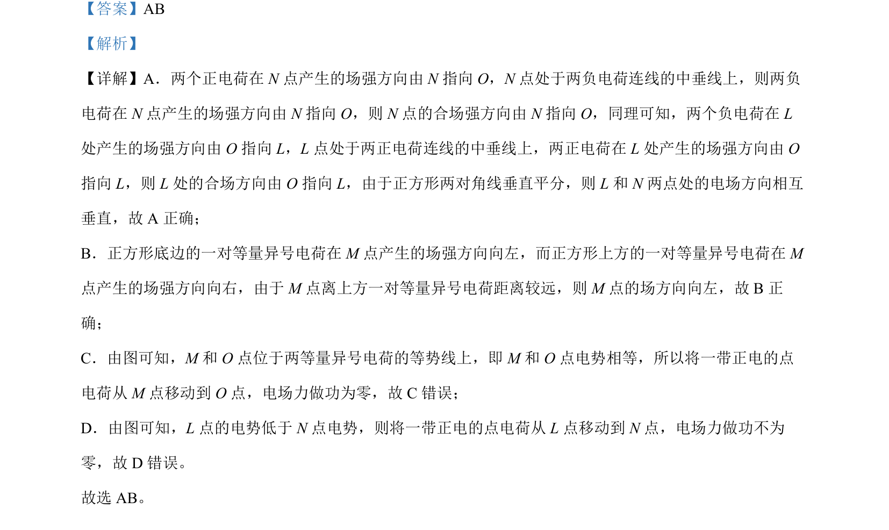

## 题面

## 摘要

本题通过分析正方形顶点电荷分布，判断各点场强方向、电势高低及电场力做功情况。

## 关联考点

- [[674-电场强度叠加|电场强度叠加]]
- [[711-等量异号电荷电场|等量异号电荷电场]]
- [[308-电势|电势]]
- [[673-电场力做功|电场力做功]]

## 答案与解析

> 📄 原 PDF 第 6 页：`素材/真题/吉林/2008-2024·（吉林）物理高考真题/2022年高考物理试卷（全国乙卷）（解析卷）.pdf`

<!-- 题干文本-start -->
## 题干文本
6. 如图，两对等量异号点电荷q+、()0q q- >固定于正方形的 4 个顶点上。L、N是该正方形两条对角线
与其内切圆的交点，O 为内切圆的圆心，M 为切点。则（　　）
A. L 和 N两点处的电场方向相互垂直
B. M 点的电场方向平行于该点处的切线，方向向左
C. 将一带正电的点电荷从 M 点移动到 O 点，电场力做正功
D. 将一带正电的点电荷从 L 点移动到 N点，电场力做功为零
<!-- 题干文本-end -->

<!-- 解析文本-start -->
## 解析文本
【答案】AB
【解析】
【详解】A．两个正电荷在 N点产生的场强方向由 N指向 O，N点处于两负电荷连线的中垂线上，则两负
电荷在 N点产生的场强方向由 N指向 O，则 N点的合场强方向由 N指向 O，同理可知，两个负电荷在 L
处产生的场强方向由 O 指向 L，L 点处于两正电荷连线的中垂线上，两正电荷在 L 处产生的场强方向由 O
指向 L，则 L 处的合场方向由 O 指向 L，由于正方形两对角线垂直平分，则 L 和 N两点处的电场方向相互
垂直，故 A 正确；
B．正方形底边的一对等量异号电荷在 M 点产生的场强方向向左，而正方形上方的一对等量异号电荷在 M
点产生的场强方向向右，由于 M 点离上方一对等量异号电荷距离较远，则 M 点的场方向向左，故 B正
确；
C．由图可知，M 和 O 点位于两等量异号电荷的等势线上，即 M 和 O 点电势相等，所以将一带正电的点
电荷从 M 点移动到 O 点，电场力做功为零，故 C错误；
D．由图可知，L 点的电势低于 N点电势，则将一带正电的点电荷从 L 点移动到 N点，电场力做功不为
零，故 D 错误。
故选 AB。
<!-- 解析文本-end -->
