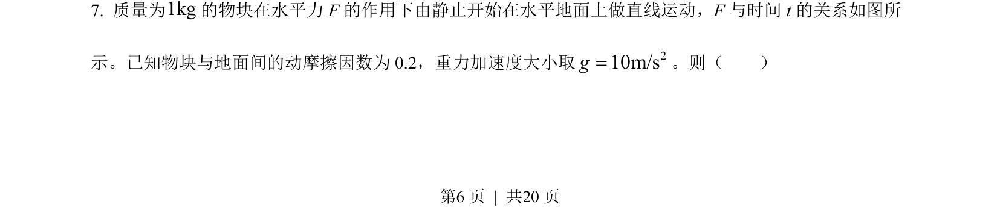
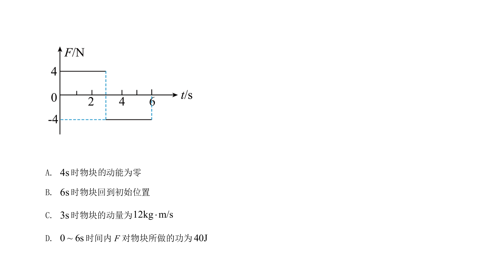
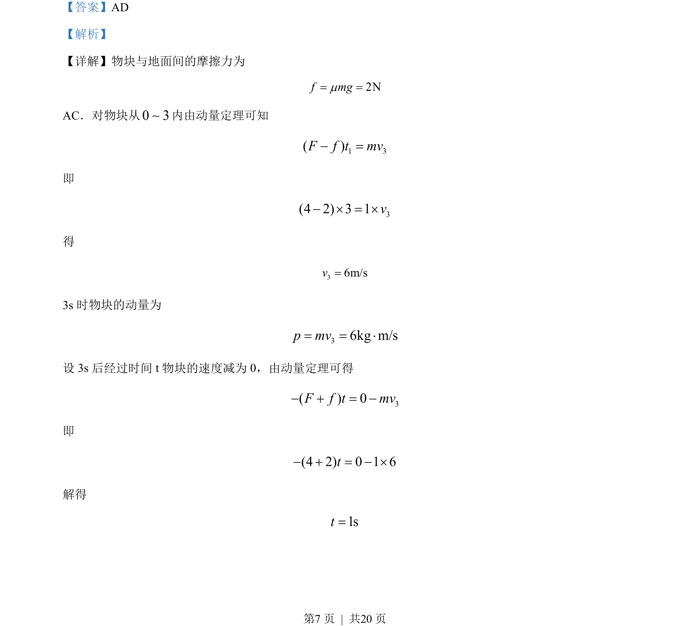
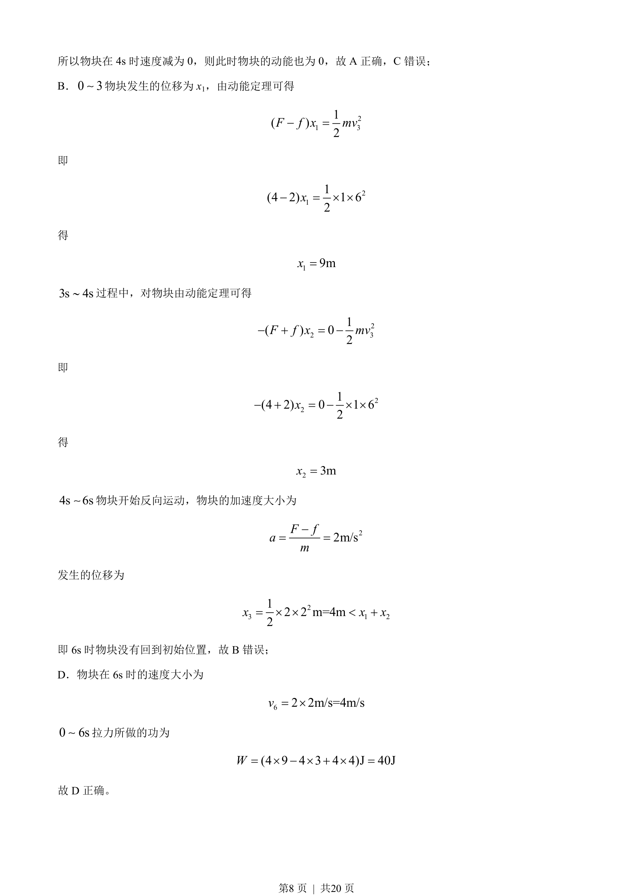

## 题面

## 摘要

该题通过物块运动分析考查动量定理、动能定理及运动学公式的综合应用。

## 关联考点

- [[349-动量定理|动量定理]]
- [[251-动能定理|动能定理]]
- [[215-匀变速直线运动|匀变速直线运动]]

## 答案与解析

> 📄 原 PDF 第 6 页：`素材/真题/吉林/2008-2024·（吉林）物理高考真题/2022年高考物理试卷（全国乙卷）（解析卷）.pdf`
