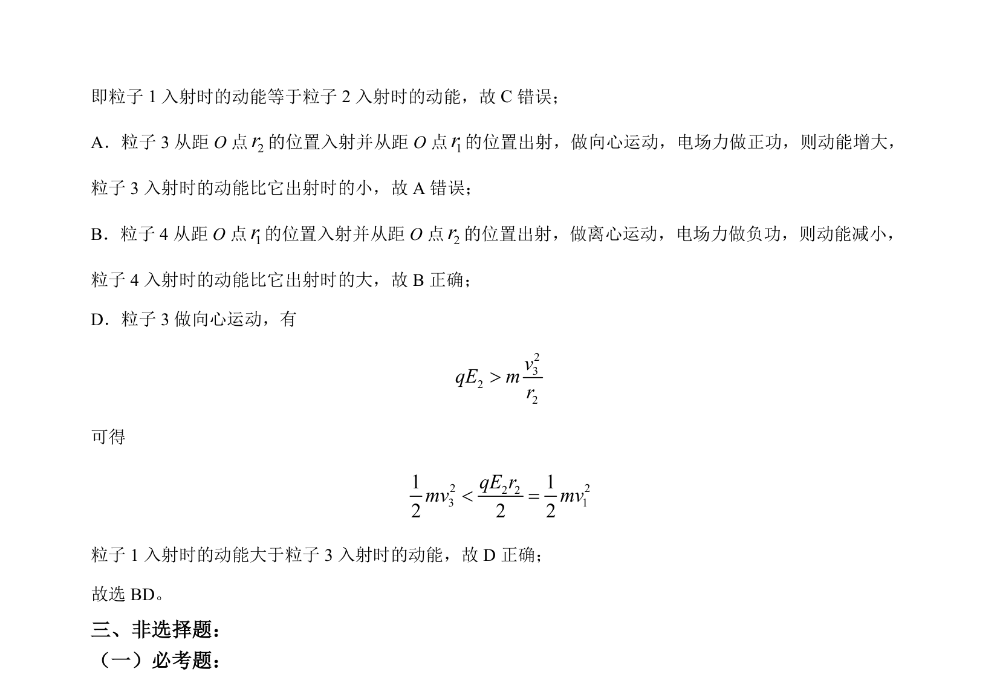

## 题面

## 摘要

带电粒子在辐向电场中的匀速圆周运动与向心、离心运动分析，比较动能大小。

## 关联考点

- [[277-电场强度|电场强度]]
- [[253-匀速圆周运动|匀速圆周运动]]
- [[251-动能定理|动能定理]]
- [[461-向心运动|向心运动]]

## 答案与解析

> 📄 原 PDF 第 9 页：`素材/真题/吉林/2008-2024·（吉林）物理高考真题/2022年高考物理试卷（全国乙卷）（解析卷）.pdf`
