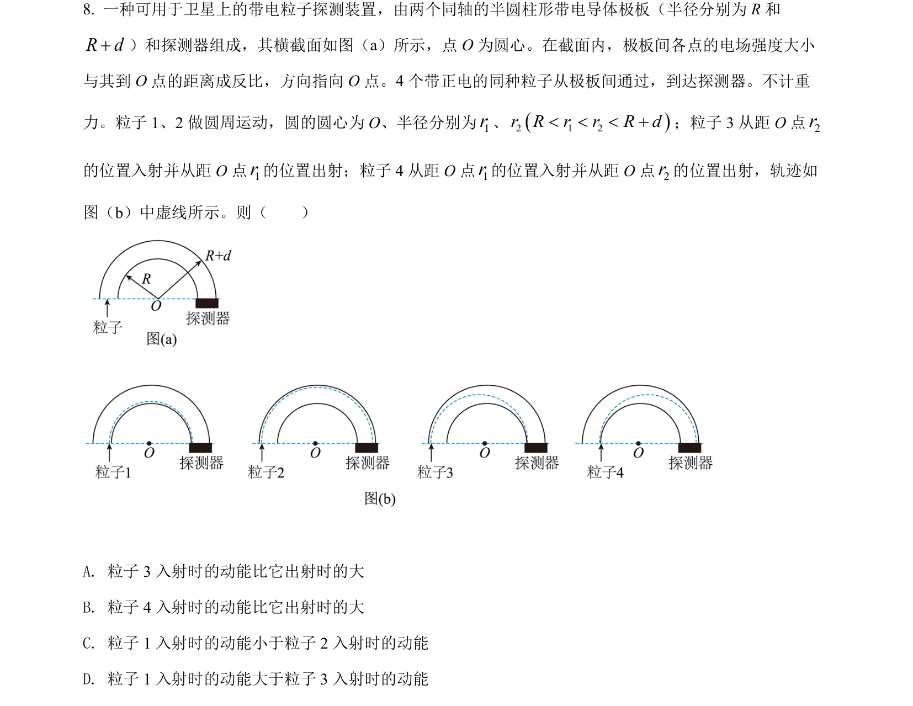
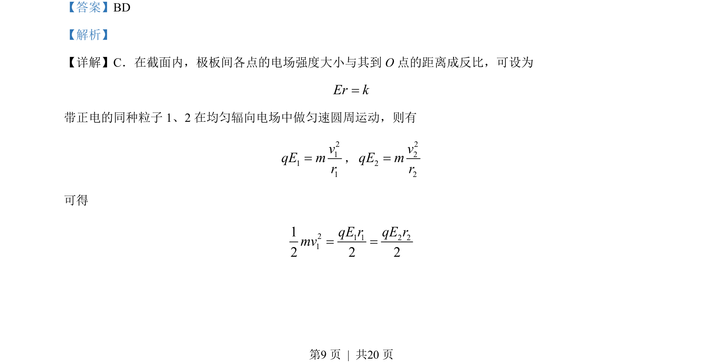

## 题面

## 摘要

本题通过辐向电场中带电粒子的运动情景，考查电场力做功与动能变化的关系及圆周运动条件。

## 关联考点

- [[242-反比例函数定义|反比例函数]]
- [[匀速圆周运动条件]]
- [[251-动能定理|动能定理]]
- [[向心与离心运动判断]]

## 答案与解析

> 📄 原 PDF 第 9 页：`素材/真题/吉林/2008-2024·（吉林）物理高考真题/2022年高考物理试卷（全国乙卷）（解析卷）.pdf`
